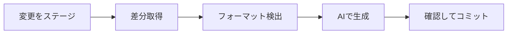

<p align="center">
  
</p>

<h1 align="center">git-sc</h1>

<p align="center">
  AIコーディングエージェントによるスマートコミットメッセージ生成CLI
</p>

<p align="center">
  <a href="https://github.com/owayo/git-smart-commit/actions/workflows/ci.yml">
    
  </a>
  <a href="https://github.com/owayo/git-smart-commit/releases/latest">
    
  </a>
  <a href="LICENSE">
    
  </a>
</p>

---

## 特徴

- **マルチプロバイダー対応**: Gemini CLI、Codex CLI、Claude Code を自動フォールバック付きでサポート
- **スマートクールダウン**: 失敗したプロバイダーを1時間（設定可能）優先度を下げて連続失敗を回避
- **フォーマット自動検出**: 過去のコミットから形式を自動判断（Conventional、Bracket、Emoji等）
- **インタラクティブ**: コミット前に確認プロンプト表示（`-y` でスキップ可能）
- **ドライラン**: コミットせずにメッセージをプレビュー（`-n`）
- **本文サポート**: 箇条書き本文付きの詳細なコミットメッセージを生成（`-b`）
- **Amend/Squash/Reword**: 既存コミットのメッセージを再生成

## 動作要件

- **OS**: macOS, Linux, Windows
- **Git**: 必須
- **AIプロバイダー**（少なくとも1つ）:
  - Gemini CLI: `npm install -g @google/gemini-cli`
  - Codex CLI: `npm install -g @openai/codex`
  - Claude Code: `npm install -g @anthropic-ai/claude-code`

## インストール

### GitHub Releases から（推奨）

[Releases](https://github.com/owayo/git-smart-commit/releases) からお使いのプラットフォーム用のバイナリをダウンロード。

#### macOS (Apple Silicon)

```bash
curl -L https://github.com/owayo/git-smart-commit/releases/latest/download/git-sc-aarch64-apple-darwin.tar.gz | tar xz
sudo mv git-sc /usr/local/bin/
```

#### macOS (Intel)

```bash
curl -L https://github.com/owayo/git-smart-commit/releases/latest/download/git-sc-x86_64-apple-darwin.tar.gz | tar xz
sudo mv git-sc /usr/local/bin/
```

#### Linux (x86_64)

```bash
curl -L https://github.com/owayo/git-smart-commit/releases/latest/download/git-sc-x86_64-unknown-linux-gnu.tar.gz | tar xz
sudo mv git-sc /usr/local/bin/
```

#### Linux (ARM64)

```bash
curl -L https://github.com/owayo/git-smart-commit/releases/latest/download/git-sc-aarch64-unknown-linux-gnu.tar.gz | tar xz
sudo mv git-sc /usr/local/bin/
```

#### Windows

[Releases](https://github.com/owayo/git-smart-commit/releases) から `git-sc-x86_64-pc-windows-msvc.zip` をダウンロードし、展開して PATH に追加。

### ソースから

```bash
git clone https://github.com/owayo/git-smart-commit.git
cd git-smart-commit
make install
```

## クイックスタート

```bash
# ステージされた変更のコミットメッセージを生成
git-sc

# 全ステージして確認なしでコミット
git-sc -a -y

# メッセージをプレビュー（ドライラン）
git-sc -n
```

## 使い方

### コマンド

| コマンド | 説明 |
|---------|------|
| `git-sc` | ステージされた変更のメッセージを生成 |
| `git-sc -a` | 全ての変更をステージしてメッセージ生成 |
| `git-sc --amend` | 直前のコミットメッセージを再生成 |
| `git-sc --squash <BASE>` | 全コミットを1つにまとめる |
| `git-sc --reword <HASH>` | 特定コミットのメッセージを再生成 |
| `git-sc -g <HASH>` | 既存コミットからメッセージ生成（出力のみ） |

### オプション

| オプション | 短縮 | 説明 |
|-----------|------|------|
| `--yes` | `-y` | 確認プロンプトをスキップ |
| `--dry-run` | `-n` | コミットせずにメッセージを表示 |
| `--all` | `-a` | 全ての変更をステージ |
| `--body` | `-b` | 箇条書き本文付きで生成 |
| `--amend` | | 直前のコミットを再生成 |
| `--squash` | | コミットを1つにまとめる |
| `--reword` | | 特定コミットを再生成 |
| `--generate-for` | `-g` | コミットdiffからメッセージ生成 |
| `--lang` | `-l` | 言語設定を上書き |
| `--debug` | `-d` | AIに渡すプロンプトを表示 |
| `--help` | `-h` | ヘルプを表示 |
| `--version` | `-V` | バージョンを表示 |

### 使用例

```bash
# 基本的な使い方
git-sc                      # ステージされた変更のメッセージ生成
git-sc -a -y                # 全ステージして直接コミット

# プレビューと本文
git-sc -n                   # ドライラン（プレビューのみ）
git-sc -b                   # 詳細な本文付き

# Amend と Squash
git-sc --amend              # 直前のコミットメッセージを再生成
git-sc --squash origin/main # フィーチャーブランチのコミットをまとめる

# 既存コミットから生成
git-sc -g abc1234           # コミットdiffからメッセージ生成
git-sc -g abc1234 -b        # 詳細な本文付き
```

## 設定

設定ファイル: `~/.git-sc`

```toml
# AIプロバイダーの優先順位
providers = ["gemini", "codex", "claude"]

# コミットメッセージの言語
language = "Japanese"

# モデル設定
[models]
gemini = "flash"
codex = "gpt-5.1-codex-mini"
claude = "haiku"

# プロバイダークールダウン（分）
provider_cooldown_minutes = 60
```

### 設定オプション

| オプション | 説明 | デフォルト |
|-----------|------|-----------|
| `providers` | AIプロバイダーの優先順位 | `["gemini", "codex", "claude"]` |
| `language` | コミットメッセージの言語 | `"Japanese"` |
| `models.*` | 各プロバイダーのモデル | 設定参照 |
| `provider_cooldown_minutes` | 失敗プロバイダーのクールダウン | `60` |
| `prefix_rules` | URLベースのプレフィックス形式 | `[]` |
| `prefix_scripts` | 外部プレフィックススクリプト | `[]` |

### プレフィックスルール

リモートURLでコミット形式を指定:

```toml
[[prefix_rules]]
url_pattern = "github\\.com[:/]myorg/"
prefix_type = "conventional"  # conventional, bracket, colon, emoji, plain
```

### プレフィックススクリプト

外部スクリプトでカスタムプレフィックスを生成:

```toml
[[prefix_scripts]]
url_pattern = "^https://gitlab\\.example\\.com/"
script = "/path/to/prefix-generate.py"
```

## 差分の処理

- 空白のみの変更は除外
- バイナリファイルは除外
- `.git-sc-ignore` パターンを適用
- 10,000文字で切り詰め

### .git-sc-ignore

```gitignore
package-lock.json
yarn.lock
Cargo.lock
*.generated.ts
```

## VS Code 拡張機能

**[Git-SC (Smart Commit)](https://marketplace.visualstudio.com/items?itemName=owayo.vscode-git-smart-commit)** - VS Code マーケットプレイスで公開中

## Claude Code との連携

`~/.claude/settings.json` に追加:

```json
{
  "hooks": {
    "Stop": [
      {
        "matcher": "",
        "hooks": [
          {
            "type": "command",
            "command": "git-sc --all --yes"
          }
        ]
      }
    ]
  }
}
```

## 動作の仕組み



1. **環境確認**: gitリポジトリとAIエージェントの利用可否を確認
2. **設定読み込み**: `~/.git-sc` から設定を読み込み
3. **差分取得**: ステージされた変更を取得（除外設定適用）
4. **フォーマット検出**: 過去のコミットまたはルールから検出
5. **生成**: AIに送信（フォールバック付き）
6. **コミット**: 確認してコミットを作成

## ビルドコマンド

| コマンド | 説明 |
|---------|------|
| `make build` | デバッグビルド |
| `make release` | リリースビルド |
| `make install` | ビルドして /usr/local/bin にインストール |
| `make test` | テスト実行 |
| `make fmt` | コードフォーマット |
| `make check` | clippy と check を実行 |
| `make clean` | ビルド成果物をクリーン |

## コントリビュート

コントリビュートを歓迎します！お気軽にプルリクエストをお送りください。

## 変更履歴

バージョン履歴は [Releases](https://github.com/owayo/git-smart-commit/releases) を参照してください。

## ライセンス

[MIT](LICENSE)
