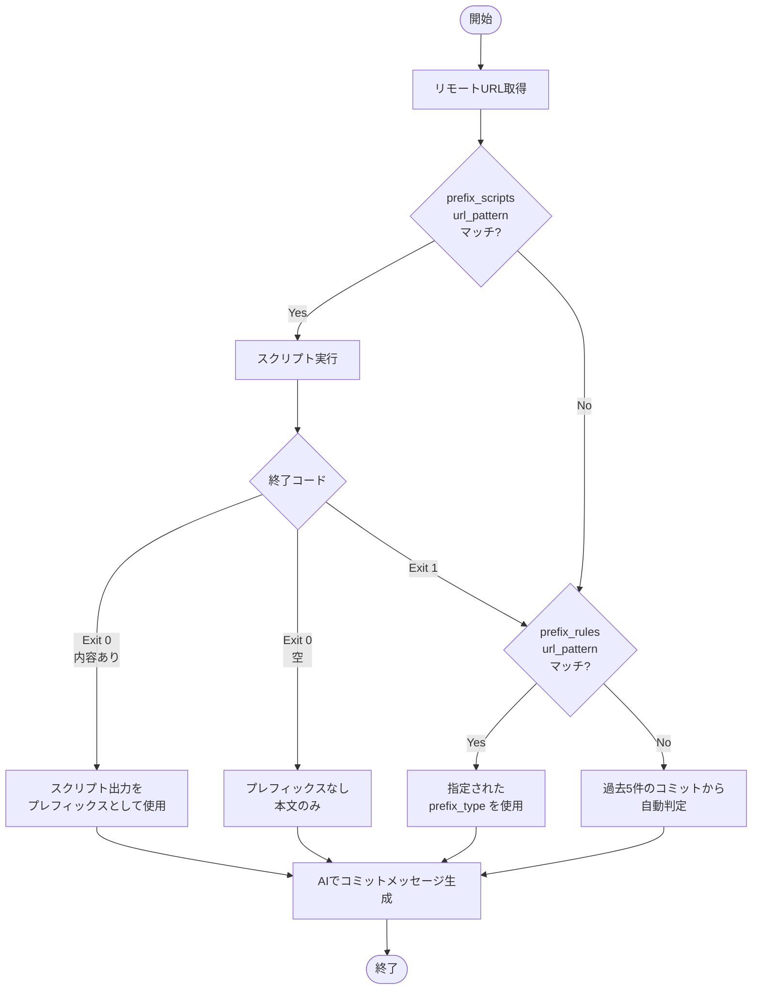

# git-sc (Git Smart Commit) 🪄

[](https://github.com/owayo/git-smart-commit/actions/workflows/ci.yml)

AIコーディングエージェント（Gemini CLI、Codex CLI、Claude Code）を活用したスマートコミットメッセージ生成CLI

`git-sc` はステージされた変更と過去のコミット履歴を分析し、CLI AIエージェントを使って文脈に適したコミットメッセージを自動フォールバック付きで生成します。

## 特徴

- **マルチプロバイダー対応**: Gemini CLI、Codex CLI、Claude Code を自動フォールバック付きでサポート
- **スマートクールダウン**: 失敗したプロバイダーを1時間（設定可能）優先度を下げて、連続失敗を回避
- **設定可能**: `~/.git-sc` でプロバイダー優先度、言語、モデルをカスタマイズ
- **フォーマット自動検出**: 過去のコミットメッセージから形式を自動判断
  - Conventional Commits (`feat:`, `fix:`, `docs:` など)
  - ブラケット形式 (`[Add]`, `[Fix]`, `[Update]` など)
  - コロン形式 (`Add:`, `Fix:`, `Update:` など)
  - 絵文字形式
  - プレーン形式
- **インタラクティブ**: コミット前に確認プロンプト表示（`-y` でスキップ可能）
- **ドライラン**: コミットせずに生成メッセージをプレビュー
- **Amend サポート**: `--amend` で直前のコミットメッセージを再生成
- **Squash サポート**: `--squash <BASE>` でブランチ内の全コミットを1つにまとめる
- **Reword サポート**: `--reword <N>` でN個前のコミットメッセージを再生成

## 前提条件

以下の CLI AIエージェントのうち、少なくとも1つがインストールされている必要があります：

- **Gemini CLI**: `npm install -g @google/gemini-cli`
- **Codex CLI**: `npm install -g @openai/codex`
- **Claude Code**: `npm install -g @anthropic-ai/claude-code`

## インストール

### GitHub Releases から（推奨）

[Releases](https://github.com/owayo/git-smart-commit/releases) からお使いのプラットフォーム用のバイナリをダウンロードしてください。

#### macOS (Apple Silicon)
```bash
curl -L https://github.com/owayo/git-smart-commit/releases/latest/download/git-sc-aarch64-apple-darwin.tar.gz | tar xz
sudo mv git-sc /usr/local/bin/
```

#### macOS (Intel)
```bash
curl -L https://github.com/owayo/git-smart-commit/releases/latest/download/git-sc-x86_64-apple-darwin.tar.gz | tar xz
sudo mv git-sc /usr/local/bin/
```

#### Linux (x86_64)
```bash
curl -L https://github.com/owayo/git-smart-commit/releases/latest/download/git-sc-x86_64-unknown-linux-gnu.tar.gz | tar xz
sudo mv git-sc /usr/local/bin/
```

#### Linux (ARM64)
```bash
curl -L https://github.com/owayo/git-smart-commit/releases/latest/download/git-sc-aarch64-unknown-linux-gnu.tar.gz | tar xz
sudo mv git-sc /usr/local/bin/
```

#### Windows

[Releases](https://github.com/owayo/git-smart-commit/releases) から `git-sc-x86_64-pc-windows-msvc.zip` をダウンロードし、展開して PATH に追加してください。

### ソースから

```bash
# リポジトリをクローン
git clone https://github.com/owayo/git-smart-commit.git
cd git-smart-commit

# ビルドしてインストール
make install
```

## 設定

初回実行時に `git-sc` は `~/.git-sc` に設定ファイルを作成します：

```toml
# AI プロバイダーの優先順序（最初に利用可能なものが使用される）
providers = [
    "gemini",
    "codex",
    "claude",
]

# コミットメッセージの言語
language = "Japanese"

# 各プロバイダーのモデル設定
[models]
gemini = "flash"
codex = "gpt-5.1-codex-mini"
claude = "haiku"

# プレフィックススクリプト設定（オプション）
# リモートURLに基づいて外部スクリプトを実行し、コミットメッセージのプレフィックスを生成
# url_pattern は正規表現
[[prefix_scripts]]
url_pattern = "^https://gitlab\\.example\\.com/"
script = "/path/to/prefix-generate.py"

[[prefix_scripts]]
url_pattern = "^git@gitlab\\.example\\.com:"
script = "/path/to/prefix-generate.py"

# プレフィックスルール設定（オプション）
# リモートURLに基づいてプレフィックス形式を指定
# url_pattern は正規表現
[[prefix_rules]]
url_pattern = "github\\.com[:/]myorg/"  # HTTPSとSSHの両方にマッチ
prefix_type = "conventional"  # conventional, bracket, colon, emoji, plain, none, またはカスタム形式

[[prefix_rules]]
url_pattern = "^https://gitlab\\.example\\.com/"
prefix_type = "emoji"

# プロバイダークールダウン設定（オプション）
# プロバイダーが失敗した場合、指定時間の間優先度を下げる
provider_cooldown_minutes = 60  # デフォルト: 60分（1時間）
```

### 設定オプション

| オプション | 説明 | デフォルト |
|-----------|------|-----------|
| `providers` | AI プロバイダーの優先順序 | `["gemini", "codex", "claude"]` |
| `language` | コミットメッセージの言語 | `"Japanese"` |
| `models.gemini` | Gemini CLI のモデル | `"flash"` |
| `models.codex` | Codex CLI のモデル | `"gpt-5.1-codex-mini"` |
| `models.claude` | Claude Code のモデル | `"haiku"` |
| `prefix_scripts` | プレフィックス生成用外部スクリプト | `[]` |
| `prefix_rules` | URLベースのプレフィックス形式設定 | `[]` |
| `provider_cooldown_minutes` | 失敗したプロバイダーの優先度を下げる時間（分） | `60` |

### プレフィックス判定の優先順位

1. **prefix_scripts**（最優先）: `url_pattern` の正規表現にマッチすればスクリプトを実行
2. **prefix_rules**: `url_pattern` の正規表現にマッチすれば指定された `prefix_type` を使用
3. **Auto**（デフォルト）: 過去5件のコミットから形式を自動判定



### プレフィックスルール

URLベースでプレフィックス形式を指定できます。

| prefix_type | 動作 |
|-------------|------|
| `conventional` | Conventional Commits形式（feat:, fix:, docs:, etc.） |
| `bracket` | ブラケット形式（[Add], [Fix], [Update], etc.） |
| `colon` | コロン形式（Add:, Fix:, Update:, etc.） |
| `emoji` | 絵文字形式（✨, 🐛, 📝, etc.） |
| `plain` | プレフィックスなし（本文のみ） |
| `none` | プレフィックスなし（本文のみ） |
| その他 | カスタム形式として指定 |

### プレフィックススクリプト

リモートURLに基づいてコミットメッセージのプレフィックスを生成する外部スクリプトを設定できます。リモートURLが `url_pattern` の正規表現にマッチする場合、スクリプトがリモートURLとブランチ名を引数として実行されます。

**スクリプトの終了コードによる動作：**

| 終了コード | 出力 | 動作 |
|-----------|------|------|
| `0` | 内容あり | 出力をカスタムプレフィックスとして使用 |
| `0` | 空 | プレフィックスなし（本文のみ） |
| `1` | - | AI生成のメッセージをそのまま使用 |

スクリプト呼び出し例：
```bash
/path/to/prefix-generate.py "git@example.com:org/repo.git" "feature/my-branch"
```

スクリプト例（疑似コード）：
```bash
#!/bin/bash
# ブランチ名や外部APIからプレフィックスを生成
PREFIX=$(generate_prefix "$1" "$2")
if [ -n "$PREFIX" ]; then
    echo -n "$PREFIX"
    exit 0
else
    exit 1  # AI生成フォーマットを使用
fi
```

## ビルドコマンド

| コマンド | 説明 |
|---------|------|
| `make build` | デバッグビルド（バージョン更新なし） |
| `make release` | リリースビルド（バージョン更新なし） |
| `make release-patch` | パッチバージョン更新してビルド (0.1.0 → 0.1.1) |
| `make release-minor` | マイナーバージョン更新してビルド (0.1.0 → 0.2.0) |
| `make release-major` | メジャーバージョン更新してビルド (0.1.0 → 1.0.0) |
| `make install` | リリースビルドして /usr/local/bin にインストール |
| `make install-release` | バージョン更新、ビルド、インストール |
| `make tag-release` | GitHub Actions リリース用の git タグを作成 |
| `make tag-release-push` | タグを作成してプッシュしリリースをトリガー |
| `make test` | テスト実行 |
| `make fmt` | コードフォーマット |
| `make check` | clippy と check を実行 |
| `make clean` | ビルド成果物をクリーン |
| `make help` | 利用可能なコマンド一覧表示 |

## 使い方

```bash
# ステージされた変更のコミットメッセージを生成
git-sc

# アンステージの変更も含めて全てをステージしてコミット
git-sc -a

# 確認プロンプトなしでメッセージ生成
git-sc -y

# コミットせずにメッセージをプレビュー（ドライラン）
git-sc -n

# 直前のコミットメッセージを再生成（amend）
git-sc --amend

# ブランチ内の全コミットを1つにまとめる（ベースブランチを指定）
git-sc --squash origin/main

# N個前のコミットメッセージを再生成（git rebase を使用）
git-sc --reword 3

# 言語設定を上書き
git-sc -l English

# オプションを組み合わせ
git-sc -a -y           # 全ステージして確認なしでコミット
git-sc -a -n           # 全ステージしてメッセージをプレビュー
git-sc --amend -y      # 確認なしで直前のコミットを修正
git-sc --squash origin/main -y  # 確認なしで全コミットをまとめる
git-sc --reword 3 -y   # 確認なしで3つ前のコミットを再生成
```

## オプション

| オプション | 短縮 | 説明 |
|-----------|------|------|
| `--yes` | `-y` | 確認プロンプトをスキップして直接コミット |
| `--dry-run` | `-n` | 実際にコミットせず生成メッセージを表示 |
| `--all` | `-a` | アンステージの変更も含めて全てをステージしてコミット |
| `--amend` | | 直前のコミットメッセージを再生成 |
| `--squash <BASE>` | | ブランチ内の全コミットを1つにまとめる（ベースブランチを指定） |
| `--reword <N>` | | N個前のコミットメッセージを再生成（git rebase を使用） |
| `--lang` | `-l` | 設定ファイルの言語設定を上書き |
| `--debug` | `-d` | デバッグモード（AIに渡すプロンプトを表示） |
| `--help` | `-h` | ヘルプ情報を表示 |
| `--version` | `-V` | バージョン情報を表示 |

## 動作の仕組み

1. **環境確認**: git リポジトリと CLI AIエージェントのインストールを確認
2. **設定読み込み**: `~/.git-sc` から設定を読み込み（存在しなければデフォルトを作成）
3. **変更をステージ**: `-a` フラグで任意で全変更をステージ
4. **差分取得**: ステージされた差分内容を取得
5. **フォーマット検出**: 過去のコミットを分析して形式を検出
6. **メッセージ生成**: 差分とフォーマット情報を CLI AIエージェントに送信（フォールバック付き）
7. **確認してコミット**: メッセージを表示して確認を求める

## 差分から除外するファイル (`.git-sc-ignore`)

リポジトリのルートに `.git-sc-ignore` ファイルを作成することで、特定のファイルやパターンを差分分析から除外できます。このファイルは `.gitignore` と同じ構文を使用します。

### `.git-sc-ignore` の例

```gitignore
# ロックファイルを除外
package-lock.json
yarn.lock
Cargo.lock

# 生成ファイルを除外
*.generated.ts
dist/

# テストフィクスチャを除外
tests/fixtures/
```

### 差分の処理

コミットメッセージを生成する際、`git-sc` は差分を以下のように処理します：

1. **空白の変更を除外**: 空白や改行のみの変更は差分に含まれません
2. **バイナリファイルを除外**: バイナリファイルの変更は自動的にフィルタリングされます
3. **`.git-sc-ignore` パターンを適用**: `.git-sc-ignore` のパターンにマッチするファイルは除外されます
4. **文字数制限**: 差分が 10,000 文字を超える場合、長すぎるプロンプトを防ぐために切り詰められます

これにより、ノイズや無関係な変更を除外し、より的確なコミットメッセージを生成できます。

## 使用例

### Conventional Commits の場合

過去のコミットが以下の場合:
```
feat: add user authentication
fix(api): resolve rate limiting issue
```

`git-sc` は以下のようなメッセージを生成:
```
feat(auth): implement password reset flow
```

### ブラケット形式の場合

過去のコミットが以下の場合:
```
[Add] new feature
[Fix] bug in auth
```

`git-sc` は以下のようなメッセージを生成:
```
[Update] refactor user service
```

### Squash（コミットまとめ）

フィーチャーブランチで複数のコミットがある場合：
```
git log --oneline
a1b2c3d feat: 最終調整
d4e5f6g fix: タイポ修正
g7h8i9j feat: バリデーション追加
j0k1l2m feat: 初期実装
```

`--squash` で1つのコミットにまとめ、AIがメッセージを生成：
```bash
$ git-sc --squash origin/main
Squash mode: combining commits into one...
Base branch: origin/main → Current branch: feature/my-feature
Commits to squash: 4
Generating commit message...
  Using Gemini CLI...

Generated commit message:
──────────────────────────────────────────────────
feat: ユーザーバリデーション機能を実装
──────────────────────────────────────────────────

Squash 4 commits? [Y/n]
```

### 基本的な使い方

prefix ruleに一致するリポジトリで、全ての変更をステージして確認なしでコミット：
```bash
$ git-sc -a -y
Staging all changes...
Using prefix rule for git@github\.com:myorg/: conventional
Generating commit message...
  Using Gemini CLI...

Generated commit message:
──────────────────────────────────────────────────
docs: 仕様駆動開発のドキュメントを追加
──────────────────────────────────────────────────

✓ Commit created successfully!
```

### Amend（コミットメッセージ再生成）

プレフィックスを自動判定させ、直前のコミットメッセージを再生成する場合：
```bash
$ git-sc --amend -y
Amend mode: regenerating message for last commit...
Recent commits (for format reference):
  docs: READMEからデフォルト値を削除
  feat: バージョンに基づくフィルタリングを実装
  fix: URLを追記
  feat: 待機手順を追加
  fix: 変数名修正
Generating commit message...
  Using Gemini CLI...

Generated commit message:
──────────────────────────────────────────────────
fix: 実行時の注意書きを修正
──────────────────────────────────────────────────

✓ Commit amended successfully!
```

### プレフィックススクリプトとの連携

プレフィックススクリプトが設定されている場合、カスタムプレフィックスが自動付与されます：
```bash
$ git-sc --amend -y
Amend mode: regenerating message for last commit...
Running prefix script for ^https://gitlab\.example\.com/myorg/...
Generating commit message...
  Using Gemini CLI...
Applied prefix: myorg/PROJECT!1234

Generated commit message:
──────────────────────────────────────────────────
myorg/PROJECT!1234 マイグレーションバージョンチェック処理追加
──────────────────────────────────────────────────

✓ Commit amended successfully!
```

### Squash の実行例

フィーチャーブランチで複数のコミットを1つにまとめる場合：
```bash
$ git-sc --squash origin/develop -y
Squash mode: combining commits into one...
Base branch: origin/develop → Current branch: feature/add-validation
Commits to squash: 13
Running prefix script for ^https://gitlab\.example\.com/myorg/...
Generating commit message...
  Using Gemini CLI...
Applied prefix: myorg/PROJECT!1500

Generated commit message:
──────────────────────────────────────────────────
myorg/PROJECT!1500 バリデーション機能を追加しCI調整
──────────────────────────────────────────────────

✓ 13 commits squashed successfully!
```

### Reword の実行例

N個前のコミットメッセージを再生成する場合：
```bash
$ git-sc --reword 2 -y
Reword mode: regenerating message for commit 2 back...
Current commit message:
  wip
Running prefix script for ^https://gitlab\.example\.com/myorg/...
Generating commit message...
  Using Gemini CLI...
  ⚠ Gemini CLI failed: [API Error: You have exhausted your daily quota on this model.]
  Using Codex CLI...
Applied prefix: myorg/PROJECT!1234

Generated commit message:
──────────────────────────────────────────────────
myorg/PROJECT!1234 add migration version check
──────────────────────────────────────────────────

✓ Commit 2 back reworded successfully!
Note: You may need to force push (git push --force) if already pushed.
```

**重要な注意点：**
- `--reword` オプションは内部で `git rebase` を使用します
- すでにプッシュ済みのコミットを変更した場合は、force push（`git push --force`）が必要です
- 対象範囲にマージコミットが含まれている場合、処理は中止されます
- rebase中にコンフリクトが発生した場合、自動的に処理が中止されます

### プロバイダーフォールバック

Gemini CLI が失敗またはインストールされていない場合、`git-sc` は自動的に次のプロバイダーを試行:
```
Using Gemini CLI...
⚠ Gemini CLI failed: [API Error: You have exhausted your daily quota on this model.]
Using Codex CLI...
✓ Commit created successfully!
```

### プロバイダークールダウン

プロバイダーが失敗した場合（例：APIクォータ超過）、`git-sc` は自動的にそのプロバイダーの優先度を設定可能な時間（デフォルト：1時間）下げます。これにより、連続した失敗を防ぎ、ユーザー体験を向上させます。

例えば、プロバイダーの順序が `gemini → codex → claude` で Gemini が失敗した場合：
- 次の1時間は、実効的な順序が `codex → claude → gemini` になります
- クールダウン期間が終了すると、元の順序に戻ります

クールダウン状態は `~/.git-sc-state` に保存され、セッション間で維持されます。

クールダウン時間をカスタマイズするには、`~/.git-sc` に追加：
```toml
provider_cooldown_minutes = 30  # デフォルトの60分ではなく30分
```

`0` に設定するとクールダウン機能を完全に無効にできます。

## Claude Code との連携

Claude Code の Hooks 機能を使用して、セッション終了時に自動でコミットメッセージを生成できます。

`~/.claude/settings.json` に以下を追加：

```json
{
  "hooks": {
    "Stop": [
      {
        "matcher": "",
        "hooks": [
          {
            "type": "command",
            "command": "git-sc --all --yes"
          }
        ]
      }
    ]
  }
}
```

これにより、Claude Code のセッション終了時に変更があれば自動的にコミットされます。変更がない場合は正常終了します。

[cchook](https://github.com/syou6162/cchook) を利用している場合は `~/.claude/cchook/config.yaml` に以下を追加：

```yaml
Stop:
  - actions:
      - type: command
        command: 'git-sc --all --yes'
```

## ライセンス

MIT
