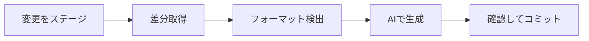

<p align="center">
  
</p>

<h1 align="center">git-sc</h1>

<p align="center">
  AIコーディングエージェントによるスマートコミットメッセージ生成CLI
</p>

<p align="center">
  <a href="https://github.com/owayo/git-smart-commit/actions/workflows/release.yml">
    
  </a>
  <a href="https://github.com/owayo/git-smart-commit/actions/workflows/ci.yml">
    
  </a>
  <a href="https://github.com/owayo/git-smart-commit/releases/latest">
    
  </a>
  <a href="LICENSE">
    
  </a>
</p>

<p align="center">
  <a href="README.md">English</a> |
  <a href="README.ja.md">日本語</a>
</p>

---

## 特徴

- **マルチプロバイダー対応**: Antigravity CLI (`agy`、Gemini CLI の後継)、Codex CLI、Claude Code、opencode、Apple Intelligence を自動フォールバック付きでサポート。同じプロバイダーを異なるモデル・アカウントで複数回並べられる（下記「応用: プロバイダーフォールバックチェーン」参照）
- **スマートクールダウン**: 失敗したステップを1時間（設定可能）優先度を下げて連続失敗を回避。provider+model+アカウント単位のキーなので、レート制限中の1アカウント/モデルが他をブロックしない
- **フォーマット自動検出**: 過去のコミットから形式を自動判断（Conventional、Bracket、Emoji等）
- **空リポジトリ対応**: コミットがまだないリポジトリでも、Git のロケールに依存せず自動判定を安全にフォールバック
- **インタラクティブ**: コミット前に確認プロンプト表示（`-y` でスキップ可能）
- **ドライラン**: コミットせずにメッセージをプレビュー（`-n`）
- **Quietモード**: フック/スクリプト向けに進捗出力を抑制（`-q`）
- **本文サポート**: 箇条書き本文付きの詳細なコミットメッセージを生成（`-b`）
- **Amend/Squash/Reword**: 既存コミットのメッセージを再生成
- **安全な一時ファイル**: Unix/macOS では AI プロンプト、Codex 最終応答、reword メッセージの一時ファイルを group/other から読めない権限で作成
- **エージェントコンテキスト**: [claw-hooks](https://github.com/owayo/claw-hooks) と連携し、エージェントの意図を反映したコンテキストを考慮したメッセージを生成

## 動作要件

- **OS**: macOS, Linux, Windows
- **Git**: 必須
- **AIプロバイダー**（少なくとも1つ）:
  - Antigravity CLI (`agy`、Gemini CLI の後継): https://antigravity.google/docs/gcli-migration を参照 (旧 Gemini CLI は 2026-06-18 で停止)
  - Codex CLI: `npm install -g @openai/codex`
  - Claude Code: `curl -fsSL https://claude.ai/install.sh | bash`
  - opencode: `curl -fsSL https://opencode.ai/install | bash`
  - Apple Intelligence: macOS版に内蔵（macOS 26+、Apple Silicon必須）

## インストール

### Homebrew (macOS/Linux)

```bash
brew install owayo/git-sc/git-sc
```

### ソースから

```bash
git clone https://github.com/owayo/git-smart-commit.git
cd git-smart-commit
make install
```

### GitHub Releases から

[Releases](https://github.com/owayo/git-smart-commit/releases) からお使いのプラットフォーム用のバイナリをダウンロード。

#### macOS (Apple Silicon)

```bash
curl -L https://github.com/owayo/git-smart-commit/releases/latest/download/git-sc-aarch64-apple-darwin.tar.gz | tar xz
sudo mv git-sc /usr/local/bin/
```

#### macOS (Intel)

```bash
curl -L https://github.com/owayo/git-smart-commit/releases/latest/download/git-sc-x86_64-apple-darwin.tar.gz | tar xz
sudo mv git-sc /usr/local/bin/
```

#### Linux (x86_64)

```bash
curl -L https://github.com/owayo/git-smart-commit/releases/latest/download/git-sc-x86_64-unknown-linux-gnu.tar.gz | tar xz
sudo mv git-sc /usr/local/bin/
```

#### Linux (ARM64)

```bash
curl -L https://github.com/owayo/git-smart-commit/releases/latest/download/git-sc-aarch64-unknown-linux-gnu.tar.gz | tar xz
sudo mv git-sc /usr/local/bin/
```

#### Windows

[Releases](https://github.com/owayo/git-smart-commit/releases) から `git-sc-x86_64-pc-windows-msvc.zip` をダウンロードし、展開して PATH に追加。

## クイックスタート

```bash
# ステージされた変更のコミットメッセージを生成
git-sc

# 全ステージして確認なしでコミット
git-sc -a -y

# メッセージをプレビュー（ドライラン）
git-sc -n
```

## 使い方

### コマンド

| コマンド | 説明 |
|---------|------|
| `git-sc` | ステージされた変更のメッセージを生成 |
| `git-sc init` | 設定ファイルを初期化 |
| `git-sc -a` | 全ての変更をステージしてメッセージ生成 |
| `git-sc --amend` | 直前のコミットメッセージを再生成 |
| `git-sc --squash <BASE>` | 全コミットを1つにまとめる |
| `git-sc --reword <HASH>` | 特定コミットのメッセージを再生成 |
| `git-sc -g <HASH>` | 既存コミットからメッセージ生成（出力のみ） |

### オプション

#### 基本オプション

| オプション | 短縮 | 説明 |
|-----------|------|------|
| `--yes` | `-y` | 確認プロンプトをスキップ |
| `--dry-run` | `-n` | コミットせずにメッセージを表示 |
| `--all` | `-a` | 全ての変更をステージ |
| `--body` | `-b` | 箇条書き本文付きで生成 |

#### 操作モード

| オプション | 短縮 | 説明 |
|-----------|------|------|
| `--amend` | | 直前のコミットメッセージを再生成 |
| `--squash` | | 全コミットを1つにまとめる |
| `--reword` | | 特定コミットのメッセージを再生成 |
| `--generate-for` | `-g` | コミットdiffからメッセージ生成（出力のみ） |

操作モード（`--amend`, `--squash`, `--reword`, `--generate-for`）は同時に指定できません。複数指定した場合は、どれか1つを暗黙に選ばず、引数パース時点でエラーになります。

`--amend` の注意:
- 現在の `HEAD` が最初のコミットでも動作します。
- 無関係な staged 変更は amend 対象のコミットに混ぜず、そのまま staged として保持します。

`--reword` の注意:
- 現在の `HEAD` 履歴に含まれるコミットのみ指定できます。
- 別ブランチなど現在の履歴外ハッシュを指定すると「無効なreword対象です」エラーで失敗します。
- 対象コミット自身が merge commit の場合も、`reword` 対象として拒否されます。
- 対象コミットと `HEAD` の間に merge commit がある場合は、「マージを跨ぐ reword は不可」という明確なエラーで拒否されます（`fatal: ambiguous argument` のような分かりにくい git 内部エラーにはなりません）。
- 現在の履歴で最古のコミットも reword できます（必要時は内部で `git rebase -i --root` を使用）。
- `HEAD` を reword する場合も、無関係な staged 変更は書き換え後のコミットに混ぜず、そのまま staged として保持します。
- 内部の rebase は `--no-autosquash` 付きで実行するため、ユーザー設定の `rebase.autoSquash = true` が範囲内の `fixup!`/`squash!` コミットを reword のついでに勝手に取り込むことはありません。

`--squash` の注意:
- 無関係な staged 変更が既にある場合、履歴を書き換える前にエラーで停止します。先に commit、unstage、または stash してください。
- squash のコミット自体が失敗した場合（`pre-commit`/`commit-msg` フックの拒否や GPG 署名エラーなど）、ブランチは merge-base に巻き戻されたまま放置されず、自動的に元の `HEAD` へ復旧されます。

#### 設定

| オプション | 短縮 | 説明 |
|-----------|------|------|
| `--provider` | `-p` | AIプロバイダーを指定 (antigravity, codex, claude, opencode, apple-intelligence)。旧名 `gemini` も後方互換のため `antigravity` として受理 |
| `--lang` | `-l` | コミットメッセージの言語を上書き |

#### デバッグ・情報

| オプション | 短縮 | 説明 |
|-----------|------|------|
| `--quiet` | `-q` | 進捗メッセージを抑制 |
| `--debug` | `-d` | AIに渡すプロンプトを表示 |
| `--help` | `-h` | ヘルプを表示 |
| `--version` | `-V` | バージョンを表示 |

`--quiet` の動作:
- 通常実行 / amend / squash / reword の進捗・プレビュー・成功/キャンセル表示を抑制
- エラー出力はそのまま表示
- `--generate-for` はパイプ処理向けに生成メッセージのみを標準出力に出力

`--debug` の動作:
- `--generate-for` と併用した場合、デバッグ出力（設定情報・AIプロンプト・プロバイダーコマンド・ストリーミング出力）はすべて標準エラー出力に出るため、標準出力は生成メッセージのみが保たれ、安全にパイプできます

### 使用例

```bash
# 基本的な使い方
git-sc                      # ステージされた変更のメッセージ生成
git-sc -a -y                # 全ステージして直接コミット

# プレビューと本文
git-sc -n                   # ドライラン（プレビューのみ）
git-sc -b                   # 詳細な本文付き

# Amend と Squash
git-sc --amend              # 直前のコミットメッセージを再生成
git-sc --squash origin/main # フィーチャーブランチのコミットをまとめる

# 既存コミットから生成
git-sc -g abc1234           # コミットdiffからメッセージ生成
git-sc -g abc1234 -b        # 詳細な本文付き
```

## 設定

### 初期設定

`git-sc init` で設定ファイルを初期化するか、`~/.config/git-sc/config.toml` を手動で作成します:

```bash
git-sc init
```

これにより `~/.config/git-sc/config.toml` にデフォルト設定の設定ファイルが作成されます。

既存の設定を上書きするには `--force` を使用します:

```bash
git-sc init --force
```

### 階層的設定

git-sc はプロジェクトレベルでの上書きが可能な階層的設定をサポートしています:

| ファイル | スコープ | 説明 |
|---------|---------|------|
| `~/.config/git-sc/config.toml` | グローバル | ユーザー全体のデフォルト設定 |
| `.git-sc` | プロジェクト | リポジトリ固有の上書き設定（リポジトリルートに配置） |

プロジェクト設定はグローバル設定を上書きします。プロジェクト設定で指定されていないフィールドはグローバル設定から継承されます。上書きしたいフィールドのみ指定できます — `[models]` セクションの部分指定もサポートしています。

### 設定例

```toml
# AIプロバイダーの優先順位
# "antigravity" は旧 Gemini CLI の後継 (`agy`)。"gemini" と書いても後方互換のため同じプロバイダーとして扱う
providers = ["opencode", "antigravity", "codex", "claude", "apple-intelligence"]

# コミットメッセージの言語
language = "Japanese"

# コミットプレフィックス形式（オプション）
# 値: conventional, bracket, colon, emoji, plain, none
prefix_type = "conventional"

# コミット後に自動プッシュ（オプション）
auto_push = true

# Codex 呼び出し時に `-c model_reasoning_effort=<値>` として渡す推論深度
# 値: "low"（デフォルト）/ "medium" / "high" / "xhigh" / "" (codex 既定動作を使う場合は空文字列)
codex_reasoning_effort = "low"

# モデル設定
# Antigravity CLI (`agy`) は `--model` に対応。`antigravity` の値はそのまま
# `agy --model "<名前>"` に渡されます。`agy models` が表示する名前
# (例: "GPT-OSS 120B (Medium)"、"Gemini 3.5 Flash (Low)") をそのまま指定してください。
# 空文字列なら `--model` を省略し agy 自身の既定モデルに委ねます。
# 旧 `gemini = "..."` キーは後方互換の入力エイリアスとして受理され、`antigravity` に
# 昇格します(両方指定した場合は `antigravity` が優先)。
[models]
antigravity = "GPT-OSS 120B (Medium)"
codex = "gpt-5.4-mini"
claude = "haiku"
opencode = ""

# プロバイダークールダウン（分）
provider_cooldown_minutes = 60

# プロバイダータイムアウト（秒）
provider_timeout_seconds = 60
```

### 設定オプション

| オプション | 説明 | デフォルト |
|-----------|------|-----------|
| `providers` | プロバイダーのフォールバックチェーン。各要素はプロバイダー名の文字列、または `{provider, model, command, env, name}` テーブル（下記「応用: プロバイダーフォールバックチェーン」参照。`antigravity` を推奨、`gemini` も後方互換で受理） | `["opencode", "antigravity", "codex", "claude", "apple-intelligence"]` |
| `language` | コミットメッセージの言語 | `"Japanese"` |
| `prefix_type` | コミットプレフィックス形式 | 自動検出 |
| `auto_push` | コミット後に自動プッシュ | `false` |
| `codex_reasoning_effort` | Codex の `-c model_reasoning_effort` に渡す値（`low`, `medium`, `high`, `xhigh`, 空文字列で省略） | `"low"` |
| `models.*` | 各プロバイダーのモデル | 設定参照 |
| `provider_cooldown_minutes` | 失敗プロバイダーのクールダウン。極端に大きい値は実質無期限として扱う | `60` |
| `provider_timeout_seconds` | プロバイダー呼び出しのタイムアウト | `60` |
| `prefix_rules` | URLベースのプレフィックス形式 | `[]` |
| `prefix_scripts` | 外部プレフィックススクリプト | `[]` |

既存のグローバル設定ファイルは自動では書き換えられません。現在の Codex 既定モデルは `gpt-5.4-mini` です。既存設定で使うには、`~/.config/git-sc/config.toml` の `models.codex` を更新してください。この既定値は、API で利用可能・一覧表示対象・`medium` reasoning 対応の Codex モデルについて `input_tokens` を比較し、2026年6月9日 (JST) に再選定し、2026年6月21日 (JST) に再確認したものです。最新計測は空ディレクトリで `Reply ok.` を使い、`--ignore-user-config --ignore-rules --ephemeral --sandbox read-only` と `model_reasoning_effort='medium'` を指定しました: `gpt-5.5` = 31033、`gpt-5.4` = 29648、`gpt-5.4-mini` = 29296。採用した試行はいずれも最終出力が `ok` で、ツール呼び出しはありません。絶対値が過去より大きく上昇しているのは、Codex 自身が `Skill descriptions were shortened` という system 通知を入力に追加するようになったためで（`--ignore-user-config` でも除外できない）、ランキングは安定しているため既定値は変更ありません。

Antigravity (`agy`) の既定モデルは `GPT-OSS 120B (Medium)` です。`agy` 1.0.8 の print mode には現状、1リクエストのトークン使用量を出力する公式の `--json` / `--output` オプションがないため、Codex のような `input_tokens` 実測比較はできません。公式 Antigravity の料金ページでは Individual plan に `gpt-oss-120b` が unlimited で含まれ、現在の `agy models` でも `GPT-OSS 120B (Medium)` が表示されるため、限界コストが最も低い既定値として維持します。2026年6月21日 (JST) 再確認。既存設定で使うには `~/.config/git-sc/config.toml` の `models.antigravity` を追加・更新するか、`""` を指定して agy 自身の既定に委ねてください。

プロバイダーのクールダウン状態は、並び替え前に旧エイリアスを正規化します。そのため `gemini`/`agy` のクールダウンは `antigravity` に、旧 `apple-ai` / `apple_intelligence` キーは `apple-intelligence` に引き続き適用されます。`--debug` 付きで実行すると、設定の providers に旧 `gemini` エイリアスが残っている場合に「`antigravity` に正規化される」旨の注意が一度だけ表示されます。

### 応用: プロバイダーフォールバックチェーン（モデル / アカウント / コマンド）

`providers` の各要素は、プロバイダー名のみの文字列に加えて、`model` / `command` / `env` を持つテーブルでも書けます。これにより、同じプロバイダーを異なるモデルやアカウントで複数回並べたフォールバックチェーンを構築できます。1つのプロバイダーがモデル系統ごと・アカウント/契約ごとにクォータを分けている場合に有用です。

```toml
providers = [
  # 同じプロバイダー・別アカウント(env で CODEX_HOME / CLAUDE_CONFIG_DIR を切替)
  { provider = "codex", model = "gpt-5.4-mini", env = { CODEX_HOME = "~/.codex" } },       # アカウント1
  { provider = "codex", model = "gpt-5.4-mini", env = { CODEX_HOME = "~/.codex-work" } },  # アカウント2
  # 同じプロバイダー・別モデル系統(クォータが別)
  { provider = "antigravity", model = "Gemini 3.5 Flash (Low)" },
  { provider = "antigravity", model = "GPT-OSS 120B (Medium)" },
  # 従来どおり文字列(プロバイダー名のみ)も使えます
  "claude",
]
```

ステップごとのフィールド:

| フィールド | 説明 |
|------------|------|
| `provider` | 必須。CLI の引数規約を決めるプロバイダー種別(`codex`/`antigravity`/`claude`/`opencode`/`apple-intelligence`、`gemini`/`agy` はエイリアス)。 |
| `model` | 任意。このステップのモデル。省略時は `[models].<provider>`、さらに各 CLI 既定にフォールバック。 |
| `command` | 任意。provider 既定バイナリの代わりに実行するバイナリ(と固定引数)。ラッパースクリプト等。`~` は展開される。codex の `--disable hooks` 等の標準引数は引き続き付与される。 |
| `env` | 任意。このステップ起動時に `Command::env()` で明示的に設定する環境変数。値の `~` は展開され、キーは POSIX 名である必要がある。動的ローダー / インタプリタの事前ロード系キー (`LD_PRELOAD`, `DYLD_INSERT_LIBRARIES`, `NODE_OPTIONS`, `PYTHONPATH` 等) は、project 側 `.git-sc` 経由のコード注入を防ぐため設定エラーとして拒否されます。 |
| `name` | 任意。クールダウンキーとログ表示に使う識別子。省略時は provider + model + env + command から決定的に導出。 |

**アカウント切替(推奨: `env`)。** Codex と Claude Code は `CODEX_HOME` / `CLAUDE_CONFIG_DIR` からアカウント/認証を選びます。これらをステップごとに `env` で設定すると、それぞれ別クォータのアカウントをまたいでフォールバックできます。git-sc は `Command::env()` で明示的に上書きするため、git-sc を起動したシェルに `CODEX_HOME` / `CLAUDE_CONFIG_DIR` が export されていても、起動される CLI はその影響を受けません。(`command` でラッパースクリプトを使う方法もありますが、`env` の方が明示的で `--debug` にも表示されるため推奨です。)

**独立したクールダウン。** クールダウンキーは provider + model + env(+ command、または明示 `name`)を含むため、各ステップは独立して降格されます。`codex` のアカウント1がレート制限に達しても、`codex` のアカウント2や、別モデルの `antigravity` は引き続き使えます。

### prefix_type の値

| 値 | 例 | 説明 |
|----|-----|------|
| `conventional` | `feat: add feature` | Conventional Commits 形式 |
| `bracket` | `[feat] add feature` | ブラケット形式 |
| `colon` | `feat: add feature` | シンプルなコロン形式 |
| `emoji` | `:sparkles: add feature` | 絵文字形式 |
| `plain` | `Add feature` | プレフィックスなし |
| `none` | `add feature` | プレフィックスなし、小文字 |

### プレフィックスルール

リモートURLでコミット形式を指定:

```toml
[[prefix_rules]]
url_pattern = "github\\.com[:/]myorg/"
prefix_type = "conventional"  # conventional, bracket, colon, emoji, plain
```

### プレフィックススクリプト

外部スクリプトでカスタムプレフィックスを生成:

```toml
[[prefix_scripts]]
url_pattern = "^https://gitlab\\.example\\.com/"
script = "/path/to/prefix-generate.py"
```

プレフィックススクリプトが有効な `prefix_type` 名（`conventional`, `bracket`, `emoji` 等）を返した場合、リテラルなプレフィックス文字列ではなくルールモードとして解釈されます。これにより、ブランチ名やリモートURLに応じてコミットフォーマットを動的に切り替えることができます。

リテラルなプレフィックス文字列では、`echo` など一般的なスクリプト出力に含まれる末尾改行（`\n`/`\r\n`）だけを除去します。プレフィックスとして意図した末尾スペースは保持されます。

プレフィックススクリプトが空文字を返した場合（exit `0` かつ標準出力なし）、git-sc は生成メッセージをそのまま使います。ただし先頭が Conventional Commits の type プレフィックス（例: `feat:`, `fix(scope):`, `feat!:`）の場合のみ、そのプレフィックスを除去します。

プレフィックススクリプトが終了コード `1` で終了した場合、git-sc はプレフィックスを追加せず AI 生成メッセージをそのまま使います。それ以外の非 0 終了コードはスクリプト実行失敗として扱い、次に一致するプレフィックススクリプト、プレフィックスルール、設定済みの `prefix_type`、または自動判定へフォールバックします。

プロジェクトレベルの `.git-sc` では、相対 `script` パスは Git リポジトリのルートから解決され、スクリプトの作業ディレクトリも Git ルートになります。

```bash
#!/bin/bash
# 例: "conventional" を返すと Conventional Commits 形式が適用される
echo "conventional"
```

## 差分の処理

- 空白のみの変更は除外
- バイナリファイルは除外
- スペースや非 ASCII 文字を含むパスの引用付き diff ヘッダーも正しく解析
- `.git-sc-ignore` パターンを適用
- 10,000文字で切り詰め

### セキュリティメモ

- AI プロンプトには staged diff の内容が含まれる場合があります。opencode などのプロバイダー向けに一時プロンプトファイルが必要な場合や Codex の最終応答ファイルを使う場合、Unix/macOS では group/other 権限を付けずに作成し、使用後に自動削除します。
- reword 用コミットメッセージの一時ファイルも同じ権限で作成します。

### .git-sc-ignore

Git が日本語ファイル名などを quoted path としてエスケープしていても、復元後の実パスに対してパターン照合します。
rename diff では変更前と変更後の両パスを対象に照合するため、無視対象ディレクトリへの移動も一貫して除外されます。
ファイル名にスペースが含まれている場合も対応しています。Git はスペースだけを含むファイル名をクォートせずに `diff --git` ヘッダーへ出力しますが、`git-sc` は正しいパスを抽出するため、無視パターンが一貫して適用されます。
変更前後のパスが異なり、両方にスペースを含む rename ヘッダーも同じように処理します。片側だけがクォートされる混在ヘッダー（例: `old name.txt` を Git がクォートする非 ASCII ファイル名へ rename した場合）も両方向に対応しています。

```gitignore
package-lock.json
yarn.lock
Cargo.lock
*.generated.ts
```

### 自動プッシュ

設定ファイルで自動プッシュを有効にできます:

```toml
# ~/.config/git-sc/config.toml または .git-sc に記述
auto_push = true
```

有効にすると、`git-sc` はコミットまたは squash 成功後に `git push` を実行します。

## VS Code 拡張機能

**[Git-SC (Smart Commit)](https://marketplace.visualstudio.com/items?itemName=owayo.vscode-git-smart-commit)** - VS Code マーケットプレイスで公開中

## Claude Code との連携

`~/.claude/settings.json` に追加:

```json
{
  "hooks": {
    "Stop": [
      {
        "matcher": "",
        "hooks": [
          {
            "type": "command",
            "command": "git-sc --all --yes --quiet"
          }
        ]
      }
    ]
  }
}
```

## エージェントコンテキスト（claw-hooks 連携）

git-sc を [claw-hooks](https://github.com/owayo/claw-hooks) と併用すると、コーディングエージェントが何を行っていたかのコンテキストが `CLAW_HOOKS_AGENT_MESSAGE` 環境変数経由で自動的に渡されます。このコンテキストはAIプロンプトに含まれ、生の差分の説明ではなく、変更の意図を反映したコミットメッセージの生成を可能にします。

**claw-hooks** は Claude Code のフックライフサイクルを管理するコンパニオンツールです。stop hook が発火する際、エージェントの最後のアクティビティサマリーを `CLAW_HOOKS_AGENT_MESSAGE` にセットしてから git-sc を呼び出します。

```bash
# claw-hooks の stop hook が自動的にセットします
# CLAW_HOOKS_AGENT_MESSAGE="認証モジュールをJWTトークン方式にリファクタリング"
git-sc -a -y -q
```

環境変数がセットされている場合、プロンプトに「Agent Context」セクションが追加され、AIが開発者の意図を優先するようガイドされます。
これは通常のコミット生成に加えて、`--amend`、`--reword`、`--squash`、`--generate-for` でも適用されます。

## 動作の仕組み


```mermaid
flowchart LR
    A[変更をステージ] --> B[差分取得]
    B --> C[フォーマット検出]
    C --> D[AIで生成]
    D --> E[確認してコミット]
```

1. **環境確認**: gitリポジトリとAIエージェントの利用可否を確認
2. **設定読み込み**: `~/.config/git-sc/config.toml` から設定を読み込み
3. **差分取得**: ステージされた変更を取得（除外設定適用）
4. **フォーマット検出**: 過去のコミットまたはルールから検出
5. **生成**: AIに送信（フォールバック付き）
6. **コミット**: 確認してコミットを作成

## Apple Intelligence

Apple Intelligence プロバイダーは、[fm-rs](https://github.com/blacktop/fm-rs)（Appleの [Foundation Models](https://developer.apple.com/documentation/foundationmodels) フレームワークのRustバインディング）を使用し、完全オンデバイス推論を行います。APIキーやネットワーク接続は不要です。

- **動作要件**: macOS 26（Tahoe）以降、Apple Silicon、システム設定でApple Intelligenceが有効であること
- **仕組み**: Apple Intelligence を有効化した状態で実行すると（macOSではデフォルト）、git-scがfm-rs経由でFoundation Modelsを直接呼び出します。コミットメッセージ生成用のinstructionsを設定した `LanguageModelSession` を毎回作成します。instructionsは解決済みのプレフィックス種別から構築されるため、`prefix_type = "none"` / `"bracket"` / `"emoji"` や直近コミットからの自動判定が尊重されます（常に Conventional Commits を強制することはありません）
- **ビルド**: `cargo build --features apple-ai`（macOSでは `make build` / `make install` で自動的に有効）
- **クロスプラットフォーム**: Linux/WindowsではApple Intelligenceは利用できず、自動的にスキップされます

## プラットフォームの注意

- **Windows**: Antigravity CLI (`agy`) プロバイダーは明示エラーでスキップされます。Windows では全プロバイダーを `cmd /C` 経由で起動します（npm でインストールされる `.cmd` シム対応のため）が、cmd.exe は複数行の diff を含むプロンプトをコマンドライン引数として安全に受け取れず、渡すとコマンドラインが破損します（CVE-2024-24576 と同クラスのコマンドインジェクション経路でもあります）。フォールバックチェーンは次のプロバイダーへ進みます。プロンプトを stdin や一時ファイルで受け取るプロバイダー（codex、claude、opencode）は影響を受けません。

## ビルドコマンド

| コマンド | 説明 |
|---------|------|
| `make build` | デバッグビルド |
| `make release` | リリースビルド |
| `make install` | ビルドして /usr/local/bin にインストール |
| `make test` | テスト実行 |
| `make fmt` | コードフォーマット |
| `make check` | clippy と cargo check を実行（macOS では `apple-ai` を含む） |
| `make clean` | ビルド成果物をクリーン |

## コントリビュート

コントリビュートを歓迎します！お気軽にプルリクエストをお送りください。

## 変更履歴

バージョン履歴は [Releases](https://github.com/owayo/git-smart-commit/releases) を参照してください。

## ライセンス

[MIT](LICENSE)
