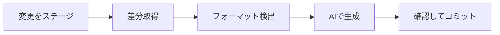

<p align="center">
  
</p>

<h1 align="center">git-sc</h1>

<p align="center">
  AI コーディングエージェントによるスマートコミットメッセージ生成 CLI
</p>

<h3 align="center">対応プラットフォーム</h3>

<p align="center">
  
  
  
  <br>
  <a href="https://github.com/owayo/git-smart-commit/actions/workflows/release.yml">
    
  </a>
  <a href="https://github.com/owayo/git-smart-commit/actions/workflows/ci.yml">
    
  </a>
  <a href="https://github.com/owayo/git-smart-commit/releases/latest">
    
  </a>
  <a href="LICENSE">
    
  </a>
</p>

<p align="center">
  <a href="README.md">English</a> |
  <a href="README.ja.md">日本語</a>
</p>

---

## 特徴

- **マルチプロバイダー対応**: Antigravity CLI（`agy`、Gemini CLI の後継）、Codex CLI、Claude Code、opencode、Grok CLI、Apple Intelligence を自動フォールバック付きでサポート。同じプロバイダーを異なるモデル・アカウントで複数回並べられる（下記「応用: プロバイダーフォールバックチェーン」を参照）
- **スマートクールダウン**: 失敗したステップの優先度を 1 時間（設定可能）下げ、同じステップで失敗を繰り返さないようにする。クールダウンはプロバイダー・モデル・アカウントの組ごとに管理するので、1 つのアカウントやモデルがレート制限に達しても、ほかのステップは巻き添えにならない
- **フォーマット自動検出**: 過去のコミットから形式を自動判断（Conventional、Bracket、Emoji など）
- **空リポジトリ対応**: コミットがまだないリポジトリでも、形式の自動判定はエラーにならず Conventional Commits 形式を使う（Git のロケールに依存しない）
- **インタラクティブ**: コミット前に確認プロンプト表示（`-y` でスキップ可能）
- **ドライラン**: コミットせずにメッセージをプレビュー（`-n`）
- **Quiet モード**: フック/スクリプト向けに進捗出力を抑制（`-q`）
- **本文サポート**: 箇条書き本文付きの詳細なコミットメッセージを生成（`-b`）
- **Amend/Squash/Reword**: 既存コミットのメッセージを再生成
- **安全な一時ファイル**: Unix/macOS では AI プロンプト、Codex の最終応答、reword メッセージの一時ファイルを group/other から読めない権限で作成
- **エージェントコンテキスト**: [claw-hooks](https://github.com/owayo/claw-hooks) と連携し、エージェントが何をしていたかを受け取って、その意図を反映したメッセージを生成

## 動作要件

- **OS**: macOS、Linux、Windows
- **Git**: 必須
- **AI プロバイダー**（少なくとも 1 つ）:
  - Antigravity CLI（`agy`、Gemini CLI の後継）: https://antigravity.google/docs/gcli-migration を参照（旧 Gemini CLI は 2026年6月18日に停止）
  - Codex CLI: `npm install -g @openai/codex`
  - Claude Code: `curl -fsSL https://claude.ai/install.sh | bash`
  - opencode: `curl -fsSL https://opencode.ai/install | bash`
  - Grok CLI（`grok`、xAI）: [cmux](https://github.com/manaflow-ai/cmux) に同梱（`/Applications/cmux.app/Contents/Resources/bin/grok`）。`grok` が `PATH` にない場合、このステップはスキップされて次のプロバイダーへ進みます。
  - Apple Intelligence: macOS でソースからビルドした場合のみ利用可能（`make install` で自動的に組み込まれる。macOS 26 以降、Apple Silicon 必須。Homebrew と GitHub Releases のバイナリには含まれない）

## インストール

### Homebrew (macOS/Linux)

```bash
brew install owayo/git-sc/git-sc
```

### WinGet (Windows)

```powershell
winget install owayo.git-sc
```

インストール後は新しいターミナルを開いてください。portable パッケージは `PATH` を書き換えるだけなので、起動中のシェルには反映されません。

### ソースから

```bash
git clone https://github.com/owayo/git-smart-commit.git
cd git-smart-commit
make install
```

macOS の `make install` は一時コピーを署名してから、インストール済みバイナリをアトミックに置き換えます。再インストール時に inode 単位の古いコード署名検証キャッシュが残る問題を防ぐためです。

### GitHub Releases から

[Releases](https://github.com/owayo/git-smart-commit/releases) からお使いのプラットフォーム用のバイナリをダウンロードしてください。

#### macOS (Apple Silicon)

```bash
curl -L https://github.com/owayo/git-smart-commit/releases/latest/download/git-sc-aarch64-apple-darwin.tar.gz | tar xz
sudo mv git-sc /usr/local/bin/
```

#### macOS (Intel)

```bash
curl -L https://github.com/owayo/git-smart-commit/releases/latest/download/git-sc-x86_64-apple-darwin.tar.gz | tar xz
sudo mv git-sc /usr/local/bin/
```

#### Linux (x86_64)

```bash
curl -L https://github.com/owayo/git-smart-commit/releases/latest/download/git-sc-x86_64-unknown-linux-gnu.tar.gz | tar xz
sudo mv git-sc /usr/local/bin/
```

#### Linux (ARM64)

```bash
curl -L https://github.com/owayo/git-smart-commit/releases/latest/download/git-sc-aarch64-unknown-linux-gnu.tar.gz | tar xz
sudo mv git-sc /usr/local/bin/
```

#### Windows

[Releases](https://github.com/owayo/git-smart-commit/releases) から `git-sc-x86_64-pc-windows-msvc.zip` をダウンロードして展開し、`PATH` に追加してください。上記の WinGet を使えばこの手順は不要です。

## クイックスタート

```bash
# ステージされた変更のコミットメッセージを生成
git-sc

# 全ステージして確認なしでコミット
git-sc -a -y

# メッセージをプレビュー（ドライラン）
git-sc -n
```

## 使い方

### コマンド

| コマンド | 説明 |
|---------|------|
| `git-sc` | ステージされた変更のメッセージを生成 |
| `git-sc init` | 設定ファイルを初期化 |
| `git-sc -a` | すべての変更をステージしてメッセージを生成 |
| `git-sc --amend` | 直前のコミットメッセージを再生成 |
| `git-sc --squash <BASE>` | 全コミットを 1 つにまとめる |
| `git-sc --reword <HASH>` | 特定コミットのメッセージを再生成 |
| `git-sc -g <HASH>` | 既存コミットからメッセージを生成（出力のみ） |

ほかの Git 操作と重なったときの保護:

- `--reword` は、rebase の進行中は実行を拒否します。reword は失敗すると必ず `git rebase --abort` を実行するため、進行中の rebase に重ねて動かすと、解決作業中の内容まで破棄してしまいます。先に rebase を完了するか中止してください。
- メッセージ生成中にステージ内容が変化した場合は、コミットを中止します（生成前後の index の tree を比較します）。生成したメッセージは変化する前の内容を説明しているため、そのままコミットすると内容とメッセージが食い違います。そのまま再実行してください。`--squash` も、reset の直前に新しくステージされた変更がないかを確認し直します。
- 通常のコミット、`--amend`、`--squash` は、生成中に `HEAD` が動いた場合も中止します。`--squash` がまとめる対象と `--amend` が書き換える対象は index ではなく履歴にあるため、別の端末でコミットされても index は変化せず、ステージ済みの変更の確認では検出できません。その状態で進むと、`--squash` は AI が見ていないコミットまで巻き込み、`--amend` はメッセージが説明していない別のコミットを書き換えてしまいます。

### オプション

#### 基本オプション

| オプション | 短縮 | 説明 |
|-----------|------|------|
| `--yes` | `-y` | 確認プロンプトをスキップ |
| `--dry-run` | `-n` | コミットせずにメッセージを表示 |
| `--all` | `-a` | すべての変更をステージ |
| `--body` | `-b` | 箇条書き本文付きで生成 |

#### 操作モード

| オプション | 短縮 | 説明 |
|-----------|------|------|
| `--amend` | | 直前のコミットメッセージを再生成 |
| `--squash` | | 全コミットを 1 つにまとめる |
| `--reword` | | 特定コミットのメッセージを再生成 |
| `--generate-for` | `-g` | コミットの差分からメッセージを生成（出力のみ） |

操作モード（`--amend`、`--squash`、`--reword`、`--generate-for`）は同時に指定できません。複数指定すると、どれか 1 つを黙って選ぶことはせず、引数の解析時にエラーになります。

`--amend` の注意:
- 現在の `HEAD` が最初のコミットでも動作します。
- 無関係なステージ済みの変更は amend 対象のコミットに混ぜず、ステージ済みのまま残します。

`--reword` の注意:
- 現在の `HEAD` 履歴に含まれるコミットのみ指定できます。
- 別ブランチなど、現在の履歴にないハッシュを指定すると「無効なreword対象です」エラーで失敗します。
- 対象コミット自身がマージコミットの場合も、reword の対象として拒否されます。
- 対象コミットと `HEAD` の間にマージコミットがある場合は、「指定範囲にマージコミットが含まれています」という明確なエラーで拒否されます（`fatal: ambiguous argument` のような分かりにくい Git 内部のエラーにはなりません）。
- 現在の履歴で最古のコミットも reword できます（必要時は内部で `git rebase -i --root` を使用）。
- `HEAD` を reword する場合も、無関係なステージ済みの変更は書き換え後のコミットに混ぜず、ステージ済みのまま残します。
- 内部の rebase は `--no-autosquash` 付きで実行します。そのため、ユーザー設定で `rebase.autoSquash = true` にしていても、範囲内の `fixup!` / `squash!` コミットが reword のついでに畳み込まれることはありません。

`--squash` の注意:
- 無関係なステージ済みの変更が既にある場合は、履歴を書き換える前にエラーで停止します。先に commit、unstage、stash のいずれかを行ってください。
- squash のコミット自体が失敗した場合（`pre-commit` / `commit-msg` フックの拒否や GPG 署名エラーなど）、ブランチは merge-base に巻き戻されたまま放置されず、自動的に元の `HEAD` へ復旧されます。

#### プロバイダーと言語

| オプション | 短縮 | 説明 |
|-----------|------|------|
| `--provider` | `-p` | AI プロバイダーを指定（`antigravity`、`codex`、`claude`、`opencode`、`grok`、`apple-intelligence`）。旧名 `gemini` も後方互換のため `antigravity` として受理 |
| `--lang` | `-l` | コミットメッセージの言語を上書き |

#### デバッグ・情報

| オプション | 短縮 | 説明 |
|-----------|------|------|
| `--quiet` | `-q` | 進捗メッセージを抑制 |
| `--debug` | `-d` | AI に渡すプロンプトを表示 |
| `--help` | `-h` | ヘルプを表示 |
| `--version` | `-V` | バージョンを表示 |

`--yes` の動作:
- 無人実行では必須です。確認プロンプトで標準入力が EOF になった場合（スクリプトやフックから標準入力を閉じた状態で呼ばれた場合など）は、`[Y/n]` の既定値を採らずにエラーで中止します。ユーザーが入力した空行は従来どおり「はい」として扱いますが、「入力そのものがない」状態は別扱いです。同じ確認プロンプトが、履歴を書き換える `--amend` / `--squash` / `--reword` の実行前にも表示されるためです。

`--quiet` の動作:
- 通常実行/amend/squash/reword の進捗・プレビュー・成功/キャンセル表示を抑制
- エラー出力はそのまま表示
- `--generate-for` はパイプ処理向けに生成メッセージのみを標準出力に出力

`--debug` の動作:
- `--generate-for` と併用した場合、デバッグ出力（設定情報・AI プロンプト・プロバイダーコマンド・ストリーミング出力）はすべて標準エラー出力に出ます。標準出力には生成メッセージだけが残るので、安全にパイプできます。
- それ以外のモードでは、`--quiet` と併用した場合も含め、デバッグ出力はすべて標準出力に出ます。`--quiet` は進捗メッセージを抑制するだけで、デバッグ出力の出力先は変えません。

### 使用例

```bash
# 基本的な使い方
git-sc                      # ステージされた変更のメッセージ生成
git-sc -a -y                # 全ステージして直接コミット

# プレビューと本文
git-sc -n                   # ドライラン（プレビューのみ）
git-sc -b                   # 詳細な本文付き

# Amend と Squash
git-sc --amend              # 直前のコミットメッセージを再生成
git-sc --squash origin/main # フィーチャーブランチのコミットをまとめる

# 既存コミットから生成
git-sc -g abc1234           # コミットdiffからメッセージ生成
git-sc -g abc1234 -b        # 詳細な本文付き
```

## 設定

### 初期設定

`git-sc init` で設定ファイルを初期化するか、`~/.config/git-sc/config.toml` を手動で作成します:

```bash
git-sc init
```

これにより、既定値を書き込んだ設定ファイルが `~/.config/git-sc/config.toml` に作成されます。

既存の設定を上書きするには `--force` を使用します:

```bash
git-sc init --force
```

### 階層的設定

git-sc の設定は階層構造になっており、プロジェクト単位で上書きできます:

| ファイル | スコープ | 説明 |
|---------|---------|------|
| `~/.config/git-sc/config.toml` | グローバル | ユーザー全体の既定の設定 |
| `.git-sc` | プロジェクト | リポジトリ固有の上書き設定（リポジトリルートに配置） |

プロジェクト設定はグローバル設定を上書きします。プロジェクト設定に書かれていないフィールドは、グローバル設定の値を引き継ぎます。そのため、上書きしたいフィールドだけを書けば足ります。`[models]` セクションも、一部のキーだけを書けます。

### 設定例

```toml
# AIプロバイダーの優先順位
# "antigravity" は旧 Gemini CLI の後継 (`agy`)。"gemini" と書いても後方互換のため同じプロバイダーとして扱う
providers = ["opencode", "grok", "antigravity", "codex", "claude", "apple-intelligence"]

# コミットメッセージの言語
language = "Japanese"

# コミットプレフィックス形式（オプション）
# 値: conventional, bracket, colon, emoji, plain, none
prefix_type = "conventional"

# コミット後に自動プッシュ（オプション）
auto_push = true

# Codex 呼び出し時に `-c model_reasoning_effort=<値>` として渡す推論深度
# 値: "low"（デフォルト）/ "medium" / "high" / "xhigh" / "" (codex 既定動作を使う場合は空文字列)
codex_reasoning_effort = "low"

# モデル設定
# Antigravity CLI (`agy`) は `--model` に対応。`antigravity` の値はそのまま
# `agy --model "<名前>"` に渡されます。表示名 (例: "GPT-OSS 120B (Medium)"、
# "Gemini 3.5 Flash (Low)") と slug (例: "gpt-oss-120b-medium"、
# "gemini-3.5-flash-low") のどちらでも指定できます。`agy models` がどちらを表示するかは
# agy のバージョンで変わります (1.0.x は表示名、1.1.10 は slug)。未知の名前は
# 非ゼロ終了で明示的に弾かれ、既定モデルへ黙って落ちることはないため、
# 打ち間違いはそのステップの失敗として現れます。
# 空文字列なら `--model` を省略し agy 自身の既定モデルに委ねます。
# 旧 `gemini = "..."` キーは後方互換の入力エイリアスとして受理され、`antigravity` に
# 昇格します(両方指定した場合は `antigravity` が優先)。
# Grok CLI は `-m` に対応。`grok models` が返す ID (例: "grok-4.5") をそのまま指定します。
# 空文字列なら `-m` を省略し grok 自身の既定モデルに委ねます。
[models]
antigravity = "GPT-OSS 120B (Medium)"
codex = "gpt-5.6-luna"
claude = "haiku"
opencode = ""
grok = ""

# プロバイダークールダウン（分）
provider_cooldown_minutes = 60

# プロバイダータイムアウト（秒）
provider_timeout_seconds = 60
```

### 設定オプション

| オプション | 説明 | 既定値 |
|-----------|------|-----------|
| `providers` | プロバイダーのフォールバックチェーン。各要素はプロバイダー名の文字列、または `{provider, model, command, env, name}` テーブル（下記「応用: プロバイダーフォールバックチェーン」を参照。`antigravity` を推奨、`gemini` も後方互換で受理） | `["opencode", "grok", "antigravity", "codex", "claude", "apple-intelligence"]`（`apple-intelligence` は `apple-ai` 機能付きでビルドした macOS 版のみ） |
| `language` | コミットメッセージの言語 | `"Japanese"` |
| `prefix_type` | コミットプレフィックス形式 | 自動検出 |
| `auto_push` | コミット後に自動プッシュ | `false` |
| `codex_reasoning_effort` | Codex の `-c model_reasoning_effort` に渡す値（`low`、`medium`、`high`、`xhigh`、または空文字列で省略） | `"low"` |
| `models.*` | 各プロバイダーのモデル | 設定例を参照 |
| `provider_cooldown_minutes` | 失敗したプロバイダーのクールダウン。極端に大きい値は実質無期限として扱う | `60` |
| `provider_timeout_seconds` | プロバイダー呼び出しのタイムアウト | `60` |
| `prefix_rules` | URL ベースのプレフィックス形式 | `[]` |
| `prefix_scripts` | 外部プレフィックススクリプト | `[]` |
| `ai_usage` | `ai-usage` CLI による残量ゲート（「残量ゲート」を参照） | 無効 |
| `dev_log` | 開発者向け生成ログ（グローバル設定のみ。「開発者向け生成ログ」を参照） | 無効 |

既存のグローバル設定ファイルは自動では書き換えられません。現在の Codex の既定モデルは `gpt-5.6-luna` です。既存の設定で使うには、`~/.config/git-sc/config.toml` の `models.codex` を更新してください。**Codex CLI を更新したら必ず確認してください。** 以前の既定値 `gpt-5.4-mini` は Codex から削除済みです。削除されたモデル名を指定しても、Codex が別のモデルで代わりに応答することはありません。HTTP 400 が返り、git-sc はこれをプロバイダーの失敗として扱ってクールダウンに入れます。そのため、古い `models.codex` が残っていると、Codex は毎回フォールバックチェーンから黙って外れます。この既定値は、API で利用でき、一覧に表示され、推論レベル `medium` に対応する Codex モデルの `input_tokens` を比べて、2026年9月17日（JST）に選び直したものです。計測条件は、空ディレクトリ、プロンプト `Reply ok.`、`--ignore-user-config --ignore-rules --ephemeral --sandbox read-only`、`model_reasoning_effort='medium'` です。結果は `gpt-5.6-luna` = 19609、`gpt-5.5` = 20181、`gpt-5.6-sol` = 21174、`gpt-5.6-terra` = 21174、`gpt-6-astra` = 22035 でした。いずれの試行も最終出力が `ok` でツール呼び出しはなく、2 回目の計測でも全モデルが同じ値を再現しました。

Antigravity（`agy`）の既定モデルは `GPT-OSS 120B (Medium)` で、実測に基づいて選んでいます。`agy` 1.1.10 で print モードに `--output-format json` が加わり、リクエストごとの `usage` を取得できるようになりました。これで Codex と同じ `input_tokens` の比較ができます。それ以前の agy には機械可読な使用量の出力がなく、この既定値は公開価格を根拠にしていました。計測は 2026年8月4日（JST）に `agy` 1.1.10 で行い、空ディレクトリと固定プロンプト `Reply ok.` を使いました。結果は `gpt-oss-120b-medium` = 13680、`gemini-3.5-flash-medium` = 16994、`gemini-3.5-flash-low` = 16998、`gemini-3.1-pro-low` = 17684、`gemini-3.6-flash-low` = 18175、`gemini-3.6-flash-medium` = 18176、`claude-sonnet-4-6` = 19346 でした。いずれも 1 ターンで成功し、`gpt-oss-120b-medium` が次点より約 19% 少なかったため、既定値を維持しています。これは 1 リクエストあたりの最小オーバーヘッドの比較で、実作業での品質を保証するものではありません。既存の設定で使うには、`~/.config/git-sc/config.toml` の `models.antigravity` を追加・更新するか、`""` を指定して agy 自身の既定モデルに任せてください。

プロバイダーを並び替える前に、クールダウン状態に残っている旧エイリアスを正規化します。そのため、`gemini` / `agy` のクールダウンは `antigravity` に、旧 `apple-ai` / `apple_intelligence` のキーは `apple-intelligence` に、引き続き適用されます。`--debug` 付きで実行すると、設定の `providers` に旧 `gemini` エイリアスが残っている場合は、「`antigravity` に正規化される」という注意が 1 回だけ表示されます。

### 応用: プロバイダーフォールバックチェーン（モデル/アカウント/コマンド）

`providers` の各要素は、プロバイダー名のみの文字列に加えて、`model` / `command` / `env` を持つテーブルでも書けます。テーブルを使うと、同じプロバイダーをモデルやアカウントを変えて何度も並べたフォールバックチェーンを組めます。1 つのプロバイダーがモデル系統ごと、またはアカウントや契約ごとにクォータを分けている場合に役立ちます。

```toml
providers = [
  # 同じプロバイダー・別アカウント(env で CODEX_HOME / CLAUDE_CONFIG_DIR を切替)
  { provider = "codex", model = "gpt-5.6-luna", env = { CODEX_HOME = "~/.codex" } },       # アカウント1
  { provider = "codex", model = "gpt-5.6-luna", env = { CODEX_HOME = "~/.codex-work" } },  # アカウント2
  # 同じプロバイダー・別モデル系統(クォータが別)
  { provider = "antigravity", model = "Gemini 3.5 Flash (Low)" },
  { provider = "antigravity", model = "GPT-OSS 120B (Medium)" },
  # 従来どおり文字列(プロバイダー名のみ)も使えます
  "claude",
]
```

ステップごとのフィールド:

| フィールド | 説明 |
|------------|------|
| `provider` | 必須。CLI への引数の渡し方を決めるプロバイダーの種類（`codex` / `antigravity` / `claude` / `opencode` / `grok` / `apple-intelligence`。`gemini` / `agy` はエイリアス）。 |
| `model` | 任意。このステップのモデル。省略時は `[models].<provider>`、それもなければ各 CLI の既定モデルを使う。 |
| `command` | 任意。プロバイダー既定のバイナリの代わりに実行するバイナリ（と固定引数）。ラッパースクリプトなど。`~` は展開される。Codex の `--disable hooks` などの標準引数は引き続き付与される。 |
| `env` | 任意。このステップの起動時に `Command::env()` で明示的に設定する環境変数。値の `~` は展開され、キーは POSIX の変数名でなければならない。動的ローダーやインタープリターの事前ロード系のキー（`LD_PRELOAD`、`DYLD_INSERT_LIBRARIES`、`NODE_OPTIONS`、`PYTHONPATH` など）は、プロジェクト側の `.git-sc` からのコード注入を防ぐため、大文字小文字を区別せずに設定エラーとして拒否する。 |
| `name` | 任意。クールダウンキーとログ表示に使う識別子。省略時は `provider` + `model` + `env` + `command` の組み合わせから決まった規則で導出する。 |

**アカウントの切り替え（推奨: `env`）。** Codex と Claude Code は、`CODEX_HOME` / `CLAUDE_CONFIG_DIR` を見て使うアカウントと認証情報を決めます。これらをステップごとに `env` で設定すると、クォータが別々のアカウントをまたいでフォールバックできます。git-sc は `Command::env()` で明示的に上書きするので、git-sc を起動したシェルで `CODEX_HOME` / `CLAUDE_CONFIG_DIR` が export されていても、起動される CLI はその影響を受けません。（`command` でラッパースクリプトを使う方法もありますが、`env` のほうが明示的で `--debug` にも表示されるため、こちらを推奨します。）

**独立したクールダウン。** クールダウンキーには `provider` + `model` + `env`（と `command`、または明示した `name`）が含まれるため、ステップごとに独立して優先度が下がります。`codex` のアカウント 1 がレート制限に達しても、`codex` のアカウント 2 や、別モデルの `antigravity` は引き続き使えます。

### prefix_type の値

| 値 | 例 | 説明 |
|----|-----|------|
| `conventional` | `feat: add new feature` | Conventional Commits 形式 |
| `bracket` | `[Add] new feature` | ブラケット形式 |
| `colon` | `Add: new feature` | シンプルなコロン形式 |
| `emoji` | `✨ add new feature` | 絵文字形式 |
| `plain` | `Add new feature` | プレフィックスなし |
| `none` | `Add new feature` | プレフィックスなし（`plain` と同じ） |

### プレフィックスルール

リモート URL でコミット形式を指定:

```toml
[[prefix_rules]]
url_pattern = "github\\.com[:/]myorg/"
prefix_type = "conventional"  # conventional, bracket, colon, emoji, plain, none
```

一致したルールの `prefix_type` には、上記の有効な値を書く必要があります。値が無効なルールは警告を出してスキップされ、後続のプレフィックスルール、設定済みの `prefix_type`、自動判定の順に判定が続きます。

### プレフィックススクリプト

外部スクリプトでカスタムプレフィックスを生成:

```toml
[[prefix_scripts]]
url_pattern = "^https://gitlab\\.example\\.com/"
script = "/path/to/prefix-generate.py"
```

プレフィックススクリプトが有効な `prefix_type` の名前（`conventional`、`bracket`、`emoji` など）を返した場合、その出力はプレフィックスの文字列としてではなく、その `prefix_type` を指定したものとして扱われます。そのため、ブランチ名やリモート URL に応じて、スクリプトでコミット形式を切り替えられます。

プレフィックスの文字列をそのまま返す場合は、`echo` などの一般的なスクリプト出力に含まれる末尾の改行（`\n` / `\r\n`）だけを取り除きます。意図して付けた末尾のスペースは残ります。

プレフィックススクリプトが空の出力を返した場合（終了コード `0` で標準出力なし）、git-sc は生成したメッセージをそのまま使います。ただし先頭が Conventional Commits の type プレフィックス（例: `feat:`、`fix(scope):`、`feat!:`）の場合に限り、そのプレフィックスを取り除きます。

プレフィックススクリプトが終了コード `1` で終了した場合、git-sc はプレフィックスを付けず、AI が生成したメッセージをそのまま使います。0 と 1 以外の終了コードはスクリプトの実行失敗として扱い、次に一致するプレフィックススクリプト、プレフィックスルール、設定済みの `prefix_type`、自動判定の順にフォールバックします。

プロジェクトの `.git-sc` に書いた相対パスの `script` は Git リポジトリのルートから解決され、スクリプトの作業ディレクトリも Git のルートになります。

```bash
#!/bin/bash
# 例: "conventional" を返すと Conventional Commits 形式が適用される
echo "conventional"
```

## 差分の処理

- 空白のみの変更は除外
- バイナリファイルは中身を送らず、`[Binary] modified: <パス>` のような 1 行の要約に置き換え
- スペースや非 ASCII 文字を含むパスの、クォートされた diff ヘッダーも正しく解析
- `.git-sc-ignore` パターンを適用
- 10,000 文字で切り詰め

### セキュリティメモ

- AI へのプロンプトには、ステージ済みの差分の内容が含まれることがあります。opencode などのプロバイダー向けに一時的なプロンプトファイルが必要な場合や、Codex の最終応答ファイルを使う場合は、Unix/macOS では group/other の権限を付けずに作成し、使用後に自動で削除します。
- reword 用コミットメッセージの一時ファイルも同じ権限で作成します。
- プロバイダーのクールダウン状態ファイル（`~/.config/git-sc/.providers-state`）も group/other の権限を付けずに作成します。クールダウンキーには各ステップの `env` の値がそのまま含まれるためです。
- **`.git-sc-ignore` の読み込みに失敗した場合は処理を中止します。** ファイルが存在するのに読めない・解釈できない場合、除外なしで続行せずエラーで終了します。そのまま続行すると、除外したかったファイルが黙って AI プロバイダーへ送られてしまうためです。
- **`.git-sc-ignore` は diff の表示形式に関する Git 設定の影響を受けません。** 除外判定は `diff --git a/… b/…` 行からファイルパスを読んで行います。そのため、この行の形を変える設定（`diff.noprefix` / `diff.mnemonicPrefix` / `diff.srcPrefix` / `diff.dstPrefix` / `color.ui = always` / `diff.external`）がそのまま効くと、パターンが黙って一切マッチしなくなります。git-sc は diff を取得するときにプレフィックス・色・パスの基準を固定して要求するので、これらの設定があってもパターンは同じように適用されます。`diff.relative` も同様です。この設定には「git-sc を実行したディレクトリの外にある変更を diff から隠す」作用もありますが、基準を固定しているため、どのサブディレクトリで実行してもステージ済みの差分全体からメッセージが書かれます。サブモジュール関連の設定も固定しています。`diff.submodule = log` はサブモジュールのブロックヘッダーの形を変えるため、固定しなければそのブロックにパターンがマッチしなくなります。`diff.ignoreSubmodules = all` は、ステージ済みのサブモジュールのポインター変更を diff からもステージ確認からも消してしまうため、固定しなければ `--squash` が AI の見ていない変更まで畳み込むおそれがあります。同じ効果の設定は、自分の Git 設定だけでなく、リポジトリにコミットされた `.gitmodules` から入ってくることもあります。
- **プロジェクトの `.git-sc` はコードを実行できます。** `providers[].command`、`prefix_scripts[].script`、`ai_usage.command` は git-sc が起動する実行ファイルを指定する項目で、リポジトリ内の `.git-sc` もほかの設定と同じようにマージされます。信頼できないリポジトリを clone してその中で git-sc を実行すると（エージェントの Stop フック経由の自動実行を含む）、これらが指す実行ファイルが動きます。`env` のキーは検証され、動的ローダーやインタープリターの事前ロード系のキーは拒否されますが、この 3 つの項目はその対象外です。`Makefile` や Git フックと同じように、実行前にそのリポジトリの `.git-sc` を確認してください。

### .git-sc-ignore

Git が日本語のファイル名などをエスケープしてクォートしていても、元に戻した実際のパスでパターンを照合します。
rename の diff では変更前と変更後の両方のパスを照合するため、無視対象のディレクトリへの移動も同じように除外されます。
ファイル名にスペースを含む場合にも対応しています。Git は、ほかに特殊な文字がなくスペースを含むだけのファイル名を、クォートせずに `diff --git` ヘッダーへ出力します。git-sc はその場合も正しいパスを取り出すので、無視パターンは同じように適用されます。
変更前後のパスが異なり、両方にスペースを含む rename ヘッダーも同じように処理します。片側だけがクォートされる混在ヘッダー（例: `old name.txt` を Git がクォートする非 ASCII ファイル名へ rename した場合）も両方向に対応しています。

```gitignore
package-lock.json
yarn.lock
Cargo.lock
*.generated.ts
```

### 自動プッシュ

設定ファイルで自動プッシュを有効にできます:

```toml
# ~/.config/git-sc/config.toml または .git-sc に記述
auto_push = true
```

有効にすると、`git-sc` はコミットまたは squash 成功後に `git push` を実行します。

### 残量ゲート（`ai-usage` 連携）

`ai-usage` CLI がインストールされている場合、残量が尽きかけているアカウントのプロバイダーを、呼び出す前にフォールバックチェーンから外せます。既定では無効です。

```toml
[ai_usage]
enabled = true
command = ["ai-usage", "--json"]  # 省略可（実行ファイルのパスの `~` は展開されます）
threshold_percent = 95            # この使用率以上のステップを除外する
window = "nearest"                # weekly / five_hour / nearest (両者のうち高い方)
timeout_seconds = 10
```

git-sc は起動時にこのコマンドを 1 回だけ実行し、フォールバックチェーンの各ステップを対応するアカウントの使用率と照合します。`threshold_percent` 以上のステップは **その実行に限り** チェーンから外れます（プロバイダーのクールダウン状態には影響しません）。

各ステップがどのアカウントに属するかは、次のフィールドで指定できます。

```toml
[[providers]]
provider = "codex"
ai_usage_profile = "Work"          # ai-usage の `profile` と完全一致 (大文字小文字を区別)
env = { CODEX_HOME = "~/.codex-work" }

[[providers]]
provider = "antigravity"
ai_usage_group = "Claude&GPT"      # `group_label` と一致 (大文字小文字を区別しない)
```

`ai_usage_group` があるのは、1 つのアカウントの枠がモデル系統ごとに分かれている場合があるためです。Antigravity は `Gemini` と `Claude&GPT` という別々の枠を報告し、それぞれ独立に消費されます。`ai_usage_profile` を指定しない場合、git-sc はそのプロバイダーで最も使用率の低いアカウントを基準に判定します。ただしこれは **判定にしか影響しません**。ステップが実際にどのアカウントで動くかは `env` が決めるため、判定と実行を一致させたい場合は `ai_usage_profile` と `env` の両方を指定してください。

失敗時の扱いは意図的に非対称です。コマンドを実行できない・タイムアウトする・出力を解釈できない場合は、チェーンをそのままにしてコミットを続行します（補助ツールの不調でコミットを止めてはならないため）。一方、使用率の取得に成功したうえで **すべてのステップ** が閾値超過だった場合は、既定のチェーンへフォールバックせずエラーで停止します。フォールバックすると、ゲートが今しがた除外したプロバイダーをそのまま呼ぶことになるためです。

プロジェクトの `.git-sc` からはフィールド単位で上書きできます。書かなかったフィールドはグローバル設定の値がそのまま残ります。

### 開発者向け生成ログ

どのプロンプトを渡して何が返ってきたかを記録します。プロンプトを変更したときの効果を、印象ではなく実データで比較するためのものです。既定では無効です。

```toml
# ~/.config/git-sc/config.toml のみ有効（プロジェクトの .git-sc からは有効化できません）
[dev_log]
enabled = true
content = "metadata"   # metadata | full
retention_days = 14
max_total_mb = 500
```

1 回の実行につき 1 つの JSON ファイルを `~/.config/git-sc/logs/YYYY-MM-DD/` に書き出します。記録する内容は、プロンプトのハッシュと差分の統計、各プロバイダーの試行、実行の結末です。試行ごとに整形前の生応答・モデル・所要時間・品質判定と、採用/引き直し/フォールバックのどれだったかを残し、結末にはコミットした場合のハッシュも含めます。実行ごとに別のファイルに書くので、`git-sc` を同時に走らせても記録が混ざりません。また、一時ファイルに書き切ってから rename して公開するため、書きかけのファイルが完成品として解析対象に紛れ込むこともありません。

ファイル群は、そのまま JSONL に流し込んで解析できます:

```bash
find ~/.config/git-sc/logs -name '*.json' | sort | xargs jq -c .

# 例: プロバイダーごとに壊れた件名が出た回数を数える
find ~/.config/git-sc/logs -name '*.json' | xargs jq -r \
  '.attempts[] | select(.findings | length > 0) | "\(.provider)\t\(.findings[0])"' | sort | uniq -c
```

**取り扱いの注意。** 既定の `content = "metadata"` はプロンプトの統計とハッシュだけを残し、本文は残しません。プロバイダーの標準エラー出力も記録しません。Codex は標準エラー出力にプロンプトをそのまま書き出すので、記録すると差分が別の経路でログに入ってしまうためです。`content = "full"` は実際に送ったプロンプトをそのまま保存するので、ステージ済みの差分が平文でディスクに残ります。プロバイダーの生応答はどちらの詳細度でも残します。整形後のメッセージだけでは生成事故を追えないためです。環境変数の上書きは名前だけを記録し、値は残しません。ログは `0700` のディレクトリ内に `0600` で作成し、`retention_days` を過ぎたものと `max_total_mb` を超えた分（古い順）を削除します。この掃除は 1 日 1 回までです。書き込みに失敗した場合は警告を 1 行出すだけで（`--quiet` では出しません）、コミットはそのまま続行します。

グローバル設定専用にしているのは意図的です。clone したリポジトリの `.git-sc` が、ログ出力を有効にしたり、手元のコードの書き出し先を決めたりできてはいけないためです。プロジェクト側の `[dev_log]` は警告を出して無視します。

## VS Code 拡張機能

**[Git-SC (Smart Commit)](https://marketplace.visualstudio.com/items?itemName=owayo.vscode-git-smart-commit)**: VS Code マーケットプレイスで公開中

## Claude Code との連携

`~/.claude/settings.json` に追加:

```json
{
  "hooks": {
    "Stop": [
      {
        "matcher": "",
        "hooks": [
          {
            "type": "command",
            "command": "git-sc --all --yes --quiet"
          }
        ]
      }
    ]
  }
}
```

## エージェントコンテキスト（claw-hooks 連携）

git-sc を [claw-hooks](https://github.com/owayo/claw-hooks) と併用すると、コーディングエージェントが何をしていたかという情報（コンテキスト）が、環境変数 `CLAW_HOOKS_AGENT_MESSAGE` で自動的に渡されます。git-sc はこれを AI へのプロンプトに含めるので、生成されるコミットメッセージには、差分からは読み取れない変更の意図まで反映されます。

**claw-hooks** は、Claude Code のフックのライフサイクルを管理する連携ツールです。Stop フックが発火すると、エージェントが直前に行った作業の要約を `CLAW_HOOKS_AGENT_MESSAGE` にセットしてから git-sc を呼び出します。

```bash
# claw-hooks の stop hook が自動的にセットします
# CLAW_HOOKS_AGENT_MESSAGE="認証モジュールをJWTトークン方式にリファクタリング"
git-sc -a -y -q
```

この環境変数がセットされていると、プロンプトに `<agent-context>` ブロックが加わり、開発者の意図を優先するよう AI に指示します。
これは通常のコミット生成に加えて、`--amend`、`--reword`、`--squash`、`--generate-for` でも適用されます。

## 動作の仕組み


```mermaid
flowchart LR
    A[変更をステージ] --> B[差分取得]
    B --> C[フォーマット検出]
    C --> D[AIで生成]
    D --> E[確認してコミット]
```

1. **環境確認**: Git リポジトリと AI エージェントが使えるかを確認
2. **設定読み込み**: `~/.config/git-sc/config.toml` から設定を読み込み
3. **差分取得**: ステージされた変更を取得（除外設定を適用）
4. **フォーマット検出**: 過去のコミットまたはルールから検出
5. **生成**: AI に送信（フォールバック付き）
6. **コミット**: 確認してコミットを作成

## Grok CLI

Grok プロバイダーは Grok Build TUI（`grok`、xAI）を使います。この CLI はコーディングエージェントで、plan モード、セッションをまたぐ memory、web 検索、ツール実行が既定で有効です。そのため git-sc は、1 ターンの純粋関数として振る舞うよう、次のフラグで制約をかけて起動します。

| フラグ | 目的 |
|--------|------|
| `--output-format plain` | 対話 TUI ではなくヘッドレスのテキスト出力にする |
| `--sandbox read-only` | Codex のサンドボックスと同様にファイル書き込みとネットワークを禁止する |
| `--no-plan` / `--no-memory` | plan モードとセッションをまたぐ memory を無効化する（どちらも既定で有効） |
| `--disable-web-search` | web の取得と検索を無効化する |
| `--max-turns 1` | ツールのループを 1 ターンで打ち切る |
| `--verbatim` | CLI 側でプロンプトを書き換えさせない |
| `--prompt-file <一時ファイル>` | 大きな diff で `ARG_MAX` や cmd.exe のメタ文字問題を避ける |

- **モデル**: ステップの `model` > `[models].grok` > 空（grok 自身の既定に委ねる）の順で解決します。空でない場合は `grok models` が返す ID（現在は `grok-4.5` のみ）を `-m "<id>"` として渡します。同梱の既定値は空にしてあるので、今後より安価なモデルが追加されても、git-sc の新しいリリースを待たずに追随できます。
- **入手**: Grok CLI は [cmux](https://github.com/manaflow-ai/cmux) に同梱されています（`/Applications/cmux.app/Contents/Resources/bin/grok`）。`grok` が `PATH` にない場合、このステップはスキップされて次のプロバイダーへ進みます。

## Apple Intelligence

Apple Intelligence プロバイダーは、[fm-rs](https://github.com/blacktop/fm-rs)（Apple の [Foundation Models](https://developer.apple.com/documentation/foundationmodels) フレームワークの Rust バインディング）を使い、推論をすべてデバイス上で行います。API キーやネットワーク接続は不要です。

- **動作要件**: macOS 26（Tahoe）以降、Apple Silicon、システム設定で Apple Intelligence が有効であること
- **仕組み**: Apple Intelligence が有効な状態で実行すると（macOS では既定で有効）、git-sc は fm-rs 経由で Foundation Models を直接呼び出します。生成のたびに、コミットメッセージ生成用の指示（`instructions`）を設定した `LanguageModelSession` を作成します。指示は解決済みのプレフィックス形式から組み立てるので、`prefix_type = "none"` / `"bracket"` / `"emoji"` や直近コミットからの自動判定がそのまま反映されます（常に Conventional Commits を強制することはありません）。
- **コンテキスト長**: オンデバイスモデルのコンテキストは **4096 トークン**で、ほかのプロバイダーより桁違いに小さいです。git-sc は生成前にプロンプトのトークン数を計測し、収まらない場合は変更ファイル一覧を残したまま diff 本文を縮約してプロンプトを組み直します。この場合はメッセージが変更の一部だけを見て書かれることになるため、警告を表示します。縮約しても収まらないときは、コミットを失敗させずに次のプロバイダーへ進みます。
- **タイムアウト**: `provider_timeout_seconds`（既定 60 秒）が適用されます。CLI プロバイダーと同じ設定です。
- **失敗の扱い**: プロンプト起因の失敗（コンテキスト長超過・安全ガードレール・拒否・非対応言語）はクールダウンに入れません。クールダウンに入るのは、モデルが現在使えないことを示す失敗（アセット未取得・レート制限・タイムアウト）だけです。この失敗種別の判定には macOS 27 SDK 以降でのビルドが必要で、macOS 26 ではすべてプロバイダー側の失敗として扱われます。
- **ビルド**: `cargo build --features apple-ai`（macOS では `make build` / `make install` で自動的に有効）。macOS 27 以降でビルドすると Foundation Models 27 の機能（正確なトークン数計測・型付きエラー・応答ごとのトークン使用量）も有効になります。macOS 26 も引き続きサポートします。
- **クロスプラットフォーム**: Linux/Windows では Apple Intelligence は利用できず、自動的にスキップされます。

## プラットフォームの注意

- **Windows**: Antigravity CLI（`agy`）プロバイダーは、明示的なエラーを出してスキップされます。Windows では、npm でインストールされる `.cmd` シムに対応するため、すべてのプロバイダーを `cmd /C` 経由で起動します。ところが cmd.exe は、複数行の diff を含むプロンプトをコマンドライン引数として安全に受け取れず、渡すとコマンドラインが壊れます。これは CVE-2024-24576 と同じ種類のコマンドインジェクションの経路でもあります。フォールバックチェーンは次のプロバイダーへ進みます。プロンプトを標準入力や一時ファイルで受け取るプロバイダー（codex、claude、opencode、grok）は影響を受けません。

## ビルドコマンド

| コマンド | 説明 |
|---------|------|
| `make build` | デバッグビルド |
| `make release` | リリースビルド |
| `make install` | ビルドして `/usr/local/bin` にインストール |
| `make test` | テスト実行 |
| `make fmt` | コードフォーマット |
| `make check` | clippy と cargo check を実行（macOS では `apple-ai` を含む） |
| `make clean` | ビルド成果物を削除 |

## コントリビュート

コントリビュートを歓迎します！お気軽にプルリクエストをお送りください。

## 変更履歴

バージョン履歴は [Releases](https://github.com/owayo/git-smart-commit/releases) を参照してください。

## ライセンス

[MIT](LICENSE)
