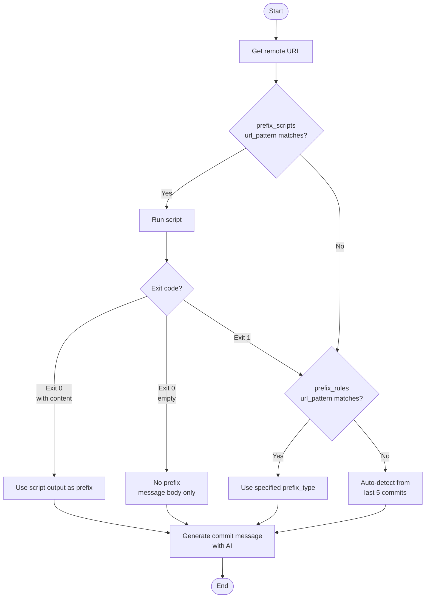

# git-sc (Git Smart Commit) 🪄

[](https://github.com/owayo/git-smart-commit/actions/workflows/ci.yml)

AI-powered smart commit message generator using coding agents (Gemini CLI, Codex CLI, or Claude Code).

`git-sc` analyzes your staged changes and past commit history to generate contextually appropriate commit messages using AI coding agents with automatic fallback support.

## Features

- **Multi-Provider Support**: Supports Gemini CLI, Codex CLI, and Claude Code with automatic fallback
- **Configurable**: Customize provider priority, language, and models via `~/.git-sc`
- **Format Detection**: Automatically detects your commit message format from recent commits:
  - Conventional Commits (`feat:`, `fix:`, `docs:`, etc.)
  - Bracket prefix (`[Add]`, `[Fix]`, `[Update]`, etc.)
  - Colon prefix (`Add:`, `Fix:`, `Update:`, etc.)
  - Emoji prefix
  - Plain format
- **Interactive**: Prompts for confirmation before committing (can be skipped with `-y`)
- **Dry Run**: Preview generated messages without committing
- **Amend Support**: Regenerate message for the last commit with `--amend`
- **Squash Support**: Combine all commits in a branch into one with `--squash <BASE>`
- **Reword Support**: Regenerate message for a commit N commits back with `--reword <N>`

## Prerequisites

At least one of the following AI coding agents must be installed:

- **Gemini CLI**: `npm install -g @google/gemini-cli`
- **Codex CLI**: `npm install -g @openai/codex`
- **Claude Code**: `npm install -g @anthropic-ai/claude-code`

## Installation

### From GitHub Releases (Recommended)

Download the latest binary for your platform from [Releases](https://github.com/owayo/git-smart-commit/releases).

#### macOS (Apple Silicon)
```bash
curl -L https://github.com/owayo/git-smart-commit/releases/latest/download/git-sc-aarch64-apple-darwin.tar.gz | tar xz
sudo mv git-sc /usr/local/bin/
```

#### macOS (Intel)
```bash
curl -L https://github.com/owayo/git-smart-commit/releases/latest/download/git-sc-x86_64-apple-darwin.tar.gz | tar xz
sudo mv git-sc /usr/local/bin/
```

#### Linux (x86_64)
```bash
curl -L https://github.com/owayo/git-smart-commit/releases/latest/download/git-sc-x86_64-unknown-linux-gnu.tar.gz | tar xz
sudo mv git-sc /usr/local/bin/
```

#### Linux (ARM64)
```bash
curl -L https://github.com/owayo/git-smart-commit/releases/latest/download/git-sc-aarch64-unknown-linux-gnu.tar.gz | tar xz
sudo mv git-sc /usr/local/bin/
```

#### Windows

Download `git-sc-x86_64-pc-windows-msvc.zip` from [Releases](https://github.com/owayo/git-smart-commit/releases), extract, and add to PATH.

### From Source

```bash
# Clone the repository
git clone https://github.com/owayo/git-smart-commit.git
cd git-smart-commit

# Build and install
make install
```

## Configuration

On first run, `git-sc` creates a configuration file at `~/.git-sc`:

```toml
# AI provider priority order (first available will be used)
providers = [
    "gemini",
    "codex",
    "claude",
]

# Language for commit messages
language = "Japanese"

# Model configuration for each provider
[models]
gemini = "flash"
codex = "gpt-5.1-codex-mini"
claude = "haiku"

# Prefix script configuration (optional)
# Execute external scripts to generate commit message prefix based on remote URL
# url_pattern is a regular expression
[[prefix_scripts]]
url_pattern = "^https://gitlab\\.example\\.com/"
script = "/path/to/prefix-generate.py"

[[prefix_scripts]]
url_pattern = "^git@gitlab\\.example\\.com:"
script = "/path/to/prefix-generate.py"

# Prefix rules configuration (optional)
# Specify prefix format based on remote URL
# url_pattern is a regular expression
[[prefix_rules]]
url_pattern = "github\\.com[:/]myorg/"  # matches both HTTPS and SSH
prefix_type = "conventional"  # conventional, bracket, colon, emoji, plain, none, or custom format

[[prefix_rules]]
url_pattern = "^https://gitlab\\.example\\.com/"
prefix_type = "emoji"
```

### Configuration Options

| Option | Description | Default |
|--------|-------------|---------|
| `providers` | Priority order of AI providers | `["gemini", "codex", "claude"]` |
| `language` | Language for commit messages | `"Japanese"` |
| `models.gemini` | Model for Gemini CLI | `"flash"` |
| `models.codex` | Model for Codex CLI | `"gpt-5.1-codex-mini"` |
| `models.claude` | Model for Claude Code | `"haiku"` |
| `prefix_scripts` | External scripts for prefix generation | `[]` |
| `prefix_rules` | URL-based prefix format configuration | `[]` |

### Prefix Priority Order

1. **prefix_scripts** (highest priority): Execute script if `url_pattern` matches (regex match)
2. **prefix_rules**: Use specified `prefix_type` if `url_pattern` matches (regex match)
3. **Auto** (default): Auto-detect format from last 5 commits



### Prefix Rules

You can specify prefix format based on the remote URL.

| prefix_type | Behavior |
|-------------|----------|
| `conventional` | Conventional Commits format (feat:, fix:, docs:, etc.) |
| `bracket` | Bracket prefix format ([Add], [Fix], [Update], etc.) |
| `colon` | Colon prefix format (Add:, Fix:, Update:, etc.) |
| `emoji` | Emoji prefix format (✨, 🐛, 📝, etc.) |
| `plain` | No prefix (message body only) |
| `none` | No prefix (message body only) |
| other | Use as custom format |

### Prefix Scripts

You can configure external scripts to generate commit message prefixes based on the remote URL. When the remote URL matches the `url_pattern` regular expression, the script is executed with the remote URL and branch name as arguments.

**Script Exit Code Behavior:**

| Exit Code | Output | Behavior |
|-----------|--------|----------|
| `0` | Has content | Use the output as custom prefix |
| `0` | Empty | No prefix (message body only) |
| `1` | - | Use AI-generated message as-is |

Example script call:
```bash
/path/to/prefix-generate.py "git@example.com:org/repo.git" "feature/my-branch"
```

Example script (pseudo-code):
```bash
#!/bin/bash
# Generate prefix based on branch name or external API
PREFIX=$(generate_prefix "$1" "$2")
if [ -n "$PREFIX" ]; then
    echo -n "$PREFIX"
    exit 0
else
    exit 1  # Use AI-generated format
fi
```

## Build Commands

| Command | Description |
|---------|-------------|
| `make build` | Build debug version (no version bump) |
| `make release` | Build release version (no version bump) |
| `make release-patch` | Bump patch version and build (0.1.0 → 0.1.1) |
| `make release-minor` | Bump minor version and build (0.1.0 → 0.2.0) |
| `make release-major` | Bump major version and build (0.1.0 → 1.0.0) |
| `make install` | Build release and install to /usr/local/bin |
| `make install-release` | Bump patch, build, and install |
| `make tag-release` | Create a git tag for GitHub Actions release |
| `make tag-release-push` | Create and push tag to trigger release |
| `make test` | Run tests |
| `make fmt` | Format code |
| `make check` | Run clippy and check |
| `make clean` | Clean build artifacts |
| `make help` | Show all available commands |

## Usage

```bash
# Generate commit message for staged changes
git-sc

# Stage all changes (including unstaged) and generate commit message
git-sc -a

# Generate message without confirmation prompt
git-sc -y

# Preview message without committing (dry run)
git-sc -n

# Regenerate message for the last commit (amend)
git-sc --amend

# Squash all commits in current branch into one (specify base branch)
git-sc --squash origin/main

# Reword a commit N commits back (regenerate message using git rebase)
git-sc --reword 3

# Override language setting
git-sc -l English

# Combine options
git-sc -a -y           # Stage all and commit without confirmation
git-sc -a -n           # Stage all and preview message
git-sc --amend -y      # Amend last commit without confirmation
git-sc --squash origin/main -y  # Squash all commits without confirmation
git-sc --reword 3 -y   # Reword commit 3 back without confirmation
```

## Options

| Option | Short | Description |
|--------|-------|-------------|
| `--yes` | `-y` | Skip confirmation prompt and commit directly |
| `--dry-run` | `-n` | Show generated message without actually committing |
| `--all` | `-a` | Stage all changes (including unstaged) and commit |
| `--amend` | | Regenerate message for the last commit |
| `--squash <BASE>` | | Combine all commits in current branch into one (specify base branch) |
| `--reword <N>` | | Regenerate message for a commit N commits back (uses git rebase) |
| `--lang` | `-l` | Override language setting from config |
| `--debug` | `-d` | Debug mode (show prompts sent to AI) |
| `--help` | `-h` | Print help information |
| `--version` | `-V` | Print version information |

## How It Works

1. **Verify Environment**: Checks for git repository and AI coding agent installation
2. **Load Config**: Reads settings from `~/.git-sc` (creates default if not exists)
3. **Stage Changes**: Optionally stages all changes with `-a` flag
4. **Get Diff**: Retrieves the staged diff content
5. **Detect Format**: Analyzes recent commits to detect your preferred format
6. **Generate Message**: Sends diff and format instructions to AI coding agent (with fallback)
7. **Confirm & Commit**: Shows the message and prompts for confirmation

## Excluding Files from Diff (`.git-sc-ignore`)

You can exclude specific files or patterns from the diff analysis by creating a `.git-sc-ignore` file in your repository root. This file uses the same syntax as `.gitignore`.

### Example `.git-sc-ignore`

```gitignore
# Exclude lock files
package-lock.json
yarn.lock
Cargo.lock

# Exclude generated files
*.generated.ts
dist/

# Exclude test fixtures
tests/fixtures/
```

### Diff Processing

When generating commit messages, `git-sc` processes the diff as follows:

1. **Whitespace changes excluded**: Changes that only affect whitespace or newlines are not included in the diff
2. **Binary files excluded**: Binary file changes are automatically filtered out
3. **`.git-sc-ignore` patterns applied**: Files matching patterns in `.git-sc-ignore` are excluded
4. **Character limit**: If the diff exceeds 10,000 characters, it is truncated to prevent overly long prompts

This helps generate more focused commit messages by excluding noisy or irrelevant changes.

## Examples

### With Conventional Commits

If your recent commits are:
```
feat: add user authentication
fix(api): resolve rate limiting issue
```

`git-sc` will generate messages like:
```
feat(auth): implement password reset flow
```

### With Bracket Prefix

If your recent commits are:
```
[Add] new feature
[Fix] bug in auth
```

`git-sc` will generate messages like:
```
[Update] refactor user service
```

### Squash Commits

When working on a feature branch with multiple commits:
```
git log --oneline
a1b2c3d feat: final adjustment
d4e5f6g fix: typo
g7h8i9j feat: add validation
j0k1l2m feat: initial implementation
```

Use `--squash` to combine them into a single commit with an AI-generated message:
```bash
git-sc --squash origin/main
# Squash mode: combining commits into one...
# Base branch: origin/main → Current branch: feature/my-feature
# Commits to squash: 4
# Generating commit message...
#
# Generated commit message:
# ──────────────────────────────────────────────────
# feat: implement user validation feature
# ──────────────────────────────────────────────────
#
# Squash 4 commits? [Y/n]
```

### Basic Usage

In a repository matching a prefix rule, stage all changes and commit without confirmation:
```bash
$ git-sc -a -y
Staging all changes...
Using prefix rule for git@github\.com:myorg/: conventional
Generating commit message...
  Using Gemini...

Generated commit message:
──────────────────────────────────────────────────
docs: add spec-driven development documentation
──────────────────────────────────────────────────

✓ Commit created successfully!
```

### Amend (Regenerate Commit Message)

Auto-detect prefix format from recent commits and regenerate the message for the last commit:
```bash
$ git-sc --amend -y
Amend mode: regenerating message for last commit...
Recent commits (for format reference):
  docs: remove default values from README
  feat: implement version-based filtering
  fix: add URL
  feat: add wait procedure
  fix: fix variable name
Generating commit message...
  Using Gemini...

Generated commit message:
──────────────────────────────────────────────────
fix: update execution notes
──────────────────────────────────────────────────

✓ Commit amended successfully!
```

### With Prefix Scripts

When prefix scripts are configured, custom prefixes are automatically applied:
```bash
$ git-sc --amend -y
Amend mode: regenerating message for last commit...
Running prefix script for ^https://gitlab\.example\.com/myorg/...
Generating commit message...
  Using Gemini...
Applied prefix: myorg/PROJECT!1234

Generated commit message:
──────────────────────────────────────────────────
myorg/PROJECT!1234 add migration version check
──────────────────────────────────────────────────

✓ Commit amended successfully!
```

### Squash Example

Combine multiple commits in a feature branch into one:
```bash
$ git-sc --squash origin/develop -y
Squash mode: combining commits into one...
Base branch: origin/develop → Current branch: feature/add-validation
Commits to squash: 13
Running prefix script for ^https://gitlab\.example\.com/myorg/...
Generating commit message...
  Using Gemini...
Applied prefix: myorg/PROJECT!1500

Generated commit message:
──────────────────────────────────────────────────
myorg/PROJECT!1500 add validation and adjust CI
──────────────────────────────────────────────────

✓ 13 commits squashed successfully!
```

### Reword Example

Regenerate commit message for a commit N commits back:
```bash
$ git-sc --reword 2 -y
Reword mode: regenerating message for commit 2 back...
Current commit message:
  wip
Running prefix script for ^https://gitlab\.example\.com/myorg/...
Generating commit message...
  Using Gemini...
  ⚠ Gemini failed: [API Error: You have exhausted your daily quota on this model.]
  Using Codex...
Applied prefix: myorg/PROJECT!1234

Generated commit message:
──────────────────────────────────────────────────
myorg/PROJECT!1234 add migration version check
──────────────────────────────────────────────────

✓ Commit 2 back reworded successfully!
Note: You may need to force push (git push --force) if already pushed.
```

**Important Notes:**
- The `--reword` option uses `git rebase` internally
- If the commit has already been pushed, you will need to force push (`git push --force`)
- If merge commits exist in the range, the operation will be aborted
- If conflicts occur during rebase, the operation will be aborted automatically

### Provider Fallback

If Gemini CLI fails or is not installed, `git-sc` automatically tries the next provider:
```
Using Gemini...
⚠ Gemini failed: [API Error: You have exhausted your daily quota on this model.]
Using Codex...
✓ Commit created successfully!
```

## Integration with Claude Code

You can use Claude Code's Hooks feature to automatically generate commit messages when a session ends.

Add the following to `~/.claude/settings.json`:

```json
{
  "hooks": {
    "Stop": [
      {
        "matcher": "",
        "hooks": [
          {
            "type": "command",
            "command": "git-sc --all --yes"
          }
        ]
      }
    ]
  }
}
```

This will automatically commit changes when a Claude Code session ends. If there are no changes, it exits gracefully.

If you are using [cchook](https://github.com/syou6162/cchook), add the following to `~/.claude/cchook/config.yaml`:

```yaml
Stop:
  - actions:
      - type: command
        command: 'git-sc --all --yes'
```

## License

MIT
