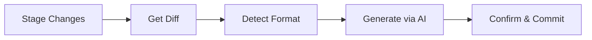

<p align="center">
  
</p>

<h1 align="center">git-sc</h1>

<p align="center">
  AI-powered smart commit message generator for coding agents
</p>

<p align="center">
  <a href="https://github.com/owayo/git-smart-commit/actions/workflows/ci.yml">
    
  </a>
  <a href="https://github.com/owayo/git-smart-commit/releases/latest">
    
  </a>
  <a href="LICENSE">
    
  </a>
</p>

---

## Features

- **Multi-Provider Support**: Supports Gemini CLI, Codex CLI, and Claude Code with automatic fallback
- **Smart Cooldown**: Automatically demotes failed providers for 1 hour (configurable)
- **Format Detection**: Detects commit format from recent commits (Conventional, Bracket, Emoji, etc.)
- **Interactive**: Prompts for confirmation before committing (skip with `-y`)
- **Dry Run**: Preview generated messages without committing (`-n`)
- **Body Support**: Generate detailed commit messages with bullet points (`-b`)
- **Amend/Squash/Reword**: Regenerate messages for existing commits

## Requirements

- **OS**: macOS, Linux, Windows
- **Git**: Required
- **AI Provider** (at least one):
  - Gemini CLI: `npm install -g @google/gemini-cli`
  - Codex CLI: `npm install -g @openai/codex`
  - Claude Code: `npm install -g @anthropic-ai/claude-code`

## Installation

### From GitHub Releases (Recommended)

Download the latest binary from [Releases](https://github.com/owayo/git-smart-commit/releases).

#### macOS (Apple Silicon)

```bash
curl -L https://github.com/owayo/git-smart-commit/releases/latest/download/git-sc-aarch64-apple-darwin.tar.gz | tar xz
sudo mv git-sc /usr/local/bin/
```

#### macOS (Intel)

```bash
curl -L https://github.com/owayo/git-smart-commit/releases/latest/download/git-sc-x86_64-apple-darwin.tar.gz | tar xz
sudo mv git-sc /usr/local/bin/
```

#### Linux (x86_64)

```bash
curl -L https://github.com/owayo/git-smart-commit/releases/latest/download/git-sc-x86_64-unknown-linux-gnu.tar.gz | tar xz
sudo mv git-sc /usr/local/bin/
```

#### Linux (ARM64)

```bash
curl -L https://github.com/owayo/git-smart-commit/releases/latest/download/git-sc-aarch64-unknown-linux-gnu.tar.gz | tar xz
sudo mv git-sc /usr/local/bin/
```

#### Windows

Download `git-sc-x86_64-pc-windows-msvc.zip` from [Releases](https://github.com/owayo/git-smart-commit/releases), extract, and add to PATH.

### From Source

```bash
git clone https://github.com/owayo/git-smart-commit.git
cd git-smart-commit
make install
```

## Quickstart

```bash
# Generate commit message for staged changes
git-sc

# Stage all and commit without confirmation
git-sc -a -y

# Preview message (dry run)
git-sc -n
```

## Usage

### Commands

| Command | Description |
|---------|-------------|
| `git-sc` | Generate message for staged changes |
| `git-sc -a` | Stage all changes and generate message |
| `git-sc --amend` | Regenerate message for last commit |
| `git-sc --squash <BASE>` | Squash all commits into one |
| `git-sc --reword <HASH>` | Regenerate message for specific commit |
| `git-sc -g <HASH>` | Generate from existing commit (output only) |

### Options

| Option | Short | Description |
|--------|-------|-------------|
| `--yes` | `-y` | Skip confirmation prompt |
| `--dry-run` | `-n` | Show message without committing |
| `--all` | `-a` | Stage all changes |
| `--body` | `-b` | Generate with body (bullet points) |
| `--amend` | | Regenerate for last commit |
| `--squash` | | Squash commits to one |
| `--reword` | | Regenerate for specific commit |
| `--generate-for` | `-g` | Generate from commit diff |
| `--lang` | `-l` | Override language setting |
| `--debug` | `-d` | Show prompts sent to AI |
| `--help` | `-h` | Print help |
| `--version` | `-V` | Print version |

### Examples

```bash
# Basic usage
git-sc                      # Generate for staged changes
git-sc -a -y                # Stage all and commit directly

# Preview and body
git-sc -n                   # Dry run (preview only)
git-sc -b                   # Include detailed body

# Amend and squash
git-sc --amend              # Regenerate last commit message
git-sc --squash origin/main # Squash feature branch commits

# Generate from existing commits
git-sc -g abc1234           # Generate from commit diff
git-sc -g abc1234 -b        # With detailed body
```

## Configuration

Config file: `~/.git-sc`

```toml
# AI provider priority
providers = ["gemini", "codex", "claude"]

# Commit message language
language = "Japanese"

# Model configuration
[models]
gemini = "flash"
codex = "gpt-5.1-codex-mini"
claude = "haiku"

# Provider cooldown (minutes)
provider_cooldown_minutes = 60
```

### Configuration Options

| Option | Description | Default |
|--------|-------------|---------|
| `providers` | AI provider priority | `["gemini", "codex", "claude"]` |
| `language` | Commit message language | `"Japanese"` |
| `models.*` | Model for each provider | See config |
| `provider_cooldown_minutes` | Failed provider cooldown | `60` |
| `prefix_rules` | URL-based prefix format | `[]` |
| `prefix_scripts` | External prefix scripts | `[]` |

### Prefix Rules

Specify commit format by remote URL:

```toml
[[prefix_rules]]
url_pattern = "github\\.com[:/]myorg/"
prefix_type = "conventional"  # conventional, bracket, colon, emoji, plain
```

### Prefix Scripts

Custom prefix generation via external scripts:

```toml
[[prefix_scripts]]
url_pattern = "^https://gitlab\\.example\\.com/"
script = "/path/to/prefix-generate.py"
```

## Diff Processing

- Whitespace-only changes excluded
- Binary files excluded
- `.git-sc-ignore` patterns applied
- Truncated at 10,000 characters

### .git-sc-ignore

```gitignore
package-lock.json
yarn.lock
Cargo.lock
*.generated.ts
```

## VS Code Extension

**[Git-SC (Smart Commit)](https://marketplace.visualstudio.com/items?itemName=owayo.vscode-git-smart-commit)** - Available on VS Code Marketplace

## Claude Code Integration

Add to `~/.claude/settings.json`:

```json
{
  "hooks": {
    "Stop": [
      {
        "matcher": "",
        "hooks": [
          {
            "type": "command",
            "command": "git-sc --all --yes"
          }
        ]
      }
    ]
  }
}
```

## How It Works



1. **Verify**: Check git repo and AI agent availability
2. **Config**: Load `~/.git-sc` settings
3. **Diff**: Get staged changes (with exclusions)
4. **Format**: Detect from recent commits or rules
5. **Generate**: Send to AI with fallback
6. **Commit**: Confirm and create commit

## Build Commands

| Command | Description |
|---------|-------------|
| `make build` | Build debug version |
| `make release` | Build release version |
| `make install` | Build and install to /usr/local/bin |
| `make test` | Run tests |
| `make fmt` | Format code |
| `make check` | Run clippy and check |
| `make clean` | Clean build artifacts |

## Contributing

Contributions are welcome! Please feel free to submit a Pull Request.

## Changelog

See [Releases](https://github.com/owayo/git-smart-commit/releases) for version history.

## License

[MIT](LICENSE)
