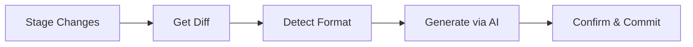

<p align="center">
  
</p>

<h1 align="center">git-sc</h1>

<p align="center">
  AI-powered smart commit message generator for coding agents
</p>

<h3 align="center">Supported Platforms</h3>

<p align="center">
  
  
  
  <br>
  <a href="https://github.com/owayo/git-smart-commit/actions/workflows/release.yml">
    
  </a>
  <a href="https://github.com/owayo/git-smart-commit/actions/workflows/ci.yml">
    
  </a>
  <a href="https://github.com/owayo/git-smart-commit/releases/latest">
    
  </a>
  <a href="LICENSE">
    
  </a>
</p>

<p align="center">
  <a href="README.md">English</a> |
  <a href="README.ja.md">日本語</a>
</p>

---

## Features

- **Multi-Provider Support**: Supports Antigravity CLI (`agy`, the successor of Gemini CLI), Codex CLI, Claude Code, opencode, Grok CLI, and Apple Intelligence with automatic fallback. The same provider can appear multiple times with different models or accounts (see "Advanced: Provider Fallback Chain" below).
- **Smart Cooldown**: Automatically demotes failed steps for 1 hour (configurable), keyed per provider+model+account so one rate-limited account or model does not block the others
- **Format Detection**: Detects commit format from recent commits (Conventional, Bracket, Emoji, etc.)
- **Empty Repo Safe**: Auto format detection falls back cleanly even when the repository has no commits and Git outputs localized messages
- **Interactive**: Prompts for confirmation before committing (skip with `-y`)
- **Dry Run**: Preview generated messages without committing (`-n`)
- **Quiet Mode**: Suppresses progress output for hook/scripting use (`-q`)
- **Body Support**: Generate detailed commit messages with bullet points (`-b`)
- **Amend/Squash/Reword**: Regenerate messages for existing commits
- **Private Temp Files**: AI prompts, Codex final-output files, and reword message files are created without group/other read permissions on Unix/macOS
- **Agent Context**: Integrates with [claw-hooks](https://github.com/owayo/claw-hooks) to generate context-aware messages reflecting the agent's intent

## Requirements

- **OS**: macOS, Linux, Windows
- **Git**: Required
- **AI Provider** (at least one):
  - Antigravity CLI (`agy`, successor of Gemini CLI): see https://antigravity.google/docs/gcli-migration (the legacy Gemini CLI stops serving requests on 2026-06-18)
  - Codex CLI: `npm install -g @openai/codex`
  - Claude Code: `curl -fsSL https://claude.ai/install.sh | bash`
  - opencode: `curl -fsSL https://opencode.ai/install | bash`
  - Grok CLI (`grok`, xAI): bundled with [cmux](https://github.com/manaflow-ai/cmux) at `/Applications/cmux.app/Contents/Resources/bin/grok`. If `grok` is not on `PATH`, the step is skipped and the chain moves on.
  - Apple Intelligence: Built-in on macOS (macOS 26+ with Apple Silicon required)

## Installation

### Homebrew (macOS/Linux)

```bash
brew install owayo/git-sc/git-sc
```

### WinGet (Windows)

```powershell
winget install owayo.git-sc
```

Open a new terminal afterwards: the portable package updates your `PATH`, and already-running shells do not pick up the change.

### From Source

```bash
git clone https://github.com/owayo/git-smart-commit.git
cd git-smart-commit
make install
```

On macOS, `make install` signs a temporary copy and then atomically replaces the installed binary. This avoids stale per-inode code-signature validation after reinstalling over an existing command.

### From GitHub Releases

Download the latest binary from [Releases](https://github.com/owayo/git-smart-commit/releases).

#### macOS (Apple Silicon)

```bash
curl -L https://github.com/owayo/git-smart-commit/releases/latest/download/git-sc-aarch64-apple-darwin.tar.gz | tar xz
sudo mv git-sc /usr/local/bin/
```

#### macOS (Intel)

```bash
curl -L https://github.com/owayo/git-smart-commit/releases/latest/download/git-sc-x86_64-apple-darwin.tar.gz | tar xz
sudo mv git-sc /usr/local/bin/
```

#### Linux (x86_64)

```bash
curl -L https://github.com/owayo/git-smart-commit/releases/latest/download/git-sc-x86_64-unknown-linux-gnu.tar.gz | tar xz
sudo mv git-sc /usr/local/bin/
```

#### Linux (ARM64)

```bash
curl -L https://github.com/owayo/git-smart-commit/releases/latest/download/git-sc-aarch64-unknown-linux-gnu.tar.gz | tar xz
sudo mv git-sc /usr/local/bin/
```

#### Windows

Download `git-sc-x86_64-pc-windows-msvc.zip` from [Releases](https://github.com/owayo/git-smart-commit/releases), extract, and add to PATH. WinGet (above) does this for you.

## Quickstart

```bash
# Generate commit message for staged changes
git-sc

# Stage all and commit without confirmation
git-sc -a -y

# Preview message (dry run)
git-sc -n
```

## Usage

### Commands

| Command | Description |
|---------|-------------|
| `git-sc` | Generate message for staged changes |
| `git-sc init` | Initialize configuration file |
| `git-sc -a` | Stage all changes and generate message |
| `git-sc --amend` | Regenerate message for last commit |
| `git-sc --squash <BASE>` | Squash all commits into one |
| `git-sc --reword <HASH>` | Regenerate message for specific commit |
| `git-sc -g <HASH>` | Generate from existing commit (output only) |

Concurrency guards worth knowing about:

- `--reword` refuses to run while a rebase is in progress. It ends every failed rebase with `git rebase --abort`, so starting one on top of yours would discard your in-progress conflict resolution. Finish or abort your rebase first.
- Committing aborts if the staged content changed while the message was being generated (git-sc compares the index tree before and after). The generated message describes the old content, so committing the new one would be wrong. Just re-run. `--squash` re-checks for newly staged changes the same way, right before it resets.
- Committing, `--amend`, and `--squash` also abort if `HEAD` moved during generation. What `--squash` folds and `--amend` rewrites comes from the history rather than the index, so a commit made in another terminal leaves the index clean and slips past the staged-changes check — a `--squash` would then fold in a commit the AI never saw, and an `--amend` would overwrite a different commit than the one it described.

### Options

#### Basic Options

| Option | Short | Description |
|--------|-------|-------------|
| `--yes` | `-y` | Skip confirmation prompt |
| `--dry-run` | `-n` | Show message without committing |
| `--all` | `-a` | Stage all changes |
| `--body` | `-b` | Generate with body (bullet points) |

#### Operation Modes

| Option | Short | Description |
|--------|-------|-------------|
| `--amend` | | Regenerate message for last commit |
| `--squash` | | Squash all commits into one |
| `--reword` | | Regenerate message for specific commit |
| `--generate-for` | `-g` | Generate from commit diff (output only) |

Operation modes (`--amend`, `--squash`, `--reword`, `--generate-for`) are mutually exclusive. Combining them fails during argument parsing instead of silently choosing one mode.

`--amend` note:
- Also works when the current `HEAD` is the root commit.
- Preserves unrelated staged changes instead of folding them into the amended commit.

`--reword` note:
- Only accepts commits reachable from the current `HEAD` history.
- Passing a hash from another branch (not in current history) fails with an error.
- Passing a merge commit hash also fails, even when the merge commit itself is the reword target.
- Rewording a commit that has a merge commit between it and `HEAD` is rejected with a clear "cannot reword across merge commits" error (merge-spanning reword is unsupported), rather than a confusing low-level git error such as `fatal: ambiguous argument`.
- Rewording the oldest commit in current history is also supported (internally uses `git rebase -i --root` when required).
- Rewording `HEAD` preserves unrelated staged changes instead of folding them into the rewritten commit.
- The internal rebase runs with `--no-autosquash`, so a user-level `rebase.autoSquash = true` config cannot silently fold `fixup!`/`squash!` commits into the reworded commit.

`--squash` note:
- Fails before rewriting history when unrelated staged changes already exist. Commit, unstage, or stash them first.
- If the squash commit itself fails (e.g. rejected by a `pre-commit`/`commit-msg` hook or a GPG signing error), the branch is automatically restored to its original `HEAD` instead of being left rewound at the merge-base.

#### Settings

| Option | Short | Description |
|--------|-------|-------------|
| `--provider` | `-p` | Use specific AI provider (antigravity, codex, claude, opencode, grok, apple-intelligence). The legacy name `gemini` is accepted as a backward-compatible alias for `antigravity`. |
| `--lang` | `-l` | Override commit message language |

#### Debug & Info

| Option | Short | Description |
|--------|-------|-------------|
| `--quiet` | `-q` | Suppress progress messages |
| `--debug` | `-d` | Show prompts sent to AI |
| `--help` | `-h` | Print help |
| `--version` | `-V` | Print version |

`--yes` behavior:
- Required for unattended runs. If the confirmation prompt reaches end-of-file on stdin (for example when git-sc is invoked from a script or hook with stdin closed), the run aborts with an error instead of taking the `[Y/n]` default. An empty line typed by a user still means yes; "no input at all" does not, because the same prompt guards `--amend`, `--squash`, and `--reword`

`--quiet` behavior:
- Suppresses progress, preview, and success/cancel messages in normal/amend/squash/reword flows
- Keeps error output visible
- In `--generate-for` mode, still prints only the generated commit message (for piping/scripting)

`--debug` behavior:
- In `--generate-for` mode, all debug output (config settings, AI prompt, provider command, streaming output) goes to stderr, so stdout remains the generated message only and stays safe to pipe
- In every other mode debug output goes to stdout as a single block, including when combined with `--quiet`. `--quiet` suppresses progress messages; it does not move debug output to stderr

### Examples

```bash
# Basic usage
git-sc                      # Generate for staged changes
git-sc -a -y                # Stage all and commit directly

# Preview and body
git-sc -n                   # Dry run (preview only)
git-sc -b                   # Include detailed body

# Amend and squash
git-sc --amend              # Regenerate last commit message
git-sc --squash origin/main # Squash feature branch commits

# Generate from existing commits
git-sc -g abc1234           # Generate from commit diff
git-sc -g abc1234 -b        # With detailed body
```

## Configuration

### Initial Setup

Initialize configuration with `git-sc init`, or create `~/.config/git-sc/config.toml` manually:

```bash
git-sc init
```

This creates a configuration file with default settings at `~/.config/git-sc/config.toml`.

Use `--force` to overwrite an existing configuration:

```bash
git-sc init --force
```

### Hierarchical Configuration

git-sc supports hierarchical configuration with project-level overrides:

| File | Scope | Description |
|------|-------|-------------|
| `~/.config/git-sc/config.toml` | Global | User-wide default settings |
| `.git-sc` | Project | Repository-specific overrides (in repo root) |

Project settings override global settings. Fields not specified in project config inherit from global config. You can specify only the fields you want to override — partial `[models]` sections are supported.

### Example Configuration

```toml
# AI provider priority
# "antigravity" is the successor of the legacy Gemini CLI (`agy` command).
# Writing "gemini" instead is still accepted as a backward-compatible alias.
providers = ["opencode", "grok", "antigravity", "codex", "claude", "apple-intelligence"]

# Commit message language
language = "Japanese"

# Commit prefix format (optional)
# Values: conventional, bracket, colon, emoji, plain, none
prefix_type = "conventional"

# Auto-push after commit (optional)
auto_push = true

# Codex reasoning effort passed via `-c model_reasoning_effort=<value>`
# Values: "low" (default), "medium", "high", "xhigh", or "" to omit and use codex default
codex_reasoning_effort = "low"

# Model configuration
# Antigravity CLI (`agy`) supports `--model`: the `antigravity` value is passed straight
# to `agy --model "<name>"`. Either spelling works — the display name
# (e.g. "GPT-OSS 120B (Medium)", "Gemini 3.5 Flash (Low)") or the slug
# (e.g. "gpt-oss-120b-medium", "gemini-3.5-flash-low"). Which one `agy models` prints
# varies by agy version (1.0.x: display names, 1.1.10: slugs). An unknown name is
# rejected with a non-zero exit rather than silently falling back, so a typo just
# fails the step. An empty string omits `--model` and lets agy pick its own default. A legacy `gemini = "..."` key is still
# accepted as an input alias and is promoted to `antigravity` (an explicit `antigravity`
# value wins if both are present).
# Grok CLI supports `-m`: pass a model ID from `grok models` (e.g. "grok-4.5").
# An empty string omits `-m` and lets grok pick its own default.
[models]
antigravity = "GPT-OSS 120B (Medium)"
codex = "gpt-5.4-mini"
claude = "haiku"
opencode = ""
grok = ""

# Provider cooldown (minutes)
provider_cooldown_minutes = 60

# Provider timeout (seconds) per call
provider_timeout_seconds = 60
```

### Configuration Options

| Option | Description | Default |
|--------|-------------|---------|
| `providers` | Provider fallback chain — each entry is a provider name string **or** a `{provider, model, command, env, name}` table (see "Advanced: Provider Fallback Chain" below; `antigravity` recommended, `gemini` accepted as an alias) | `["opencode", "grok", "antigravity", "codex", "claude", "apple-intelligence"]` (`apple-intelligence` only on macOS builds with the `apple-ai` feature) |
| `language` | Commit message language | `"Japanese"` |
| `prefix_type` | Commit prefix format | Auto-detect |
| `auto_push` | Auto-push after commit | `false` |
| `codex_reasoning_effort` | Codex `-c model_reasoning_effort` value (`low`, `medium`, `high`, `xhigh`, or `""` to omit) | `"low"` |
| `models.*` | Model for each provider | See config |
| `provider_cooldown_minutes` | Failed provider cooldown; extremely large values are treated as effectively indefinite | `60` |
| `provider_timeout_seconds` | Provider call timeout | `60` |
| `prefix_rules` | URL-based prefix format | `[]` |
| `prefix_scripts` | External prefix scripts | `[]` |
| `ai_usage` | Residual quota gate via the `ai-usage` CLI (see "Residual Quota Gate") | disabled |
| `dev_log` | Developer generation log (global config only; see "Developer Generation Log") | disabled |

Existing global config files are not rewritten automatically. The current Codex default is `gpt-5.4-mini`; to use it in an existing setup, update `models.codex` in `~/.config/git-sc/config.toml`. This default was reselected on June 9, 2026 (JST) by comparing `input_tokens` for Codex models that are API-visible, listed, and support `medium` reasoning, and re-verified on June 29, 2026 (JST). The latest measurement used `Reply ok.` in an empty directory with `--ignore-user-config --ignore-rules --ephemeral --sandbox read-only` and `model_reasoning_effort='medium'`: `gpt-5.5` = 17593, `gpt-5.4` = 16206, `gpt-5.4-mini` = 15856. All accepted runs produced `ok` and no tool calls, so the ranking is stable and the default is unchanged.

The default Antigravity (`agy`) model is `GPT-OSS 120B (Medium)`, chosen by measurement. `agy` 1.1.10 added `--output-format json` to print mode, which reports a per-request `usage` object, so the same `input_tokens` comparison used for Codex is now possible (earlier agy releases had no machine-readable usage output, and this default originally rested on published pricing instead). Measured August 4, 2026 (JST) with `agy` 1.1.10 using the fixed prompt `Reply ok.` in an empty directory: `gpt-oss-120b-medium` = 13680, `gemini-3.5-flash-medium` = 16994, `gemini-3.5-flash-low` = 16998, `gemini-3.1-pro-low` = 17684, `gemini-3.6-flash-low` = 18175, `gemini-3.6-flash-medium` = 18176, `claude-sonnet-4-6` = 19346. All runs succeeded in a single turn, and `gpt-oss-120b-medium` is the minimum by roughly 19%, so it remains the default. This measures minimal per-request overhead only and says nothing about real-workload quality. To use it in an existing setup, add or update `models.antigravity` in `~/.config/git-sc/config.toml`, or set it to `""` to defer to agy's own default.

Provider cooldown state normalizes legacy aliases before reordering providers, so `gemini`/`agy` cooldown entries still apply to `antigravity`, and legacy `apple-ai` / `apple_intelligence` entries still apply to `apple-intelligence`. Running with `--debug` also prints a one-time notice when a legacy `gemini` provider alias is found in your config, reminding you that it is normalized to `antigravity`.

### Advanced: Provider Fallback Chain (model / account / command)

Each entry in `providers` can be either a plain string (provider name only) **or** a table that also specifies `model`, `command`, and `env`. This lets you build a fallback chain where the *same* provider appears multiple times with different models or accounts — useful when one provider splits its quota per model family or per account/contract.

```toml
providers = [
  # Same provider, different accounts (switch via env: CODEX_HOME / CLAUDE_CONFIG_DIR).
  { provider = "codex", model = "gpt-5.4-mini", env = { CODEX_HOME = "~/.codex" } },       # account 1
  { provider = "codex", model = "gpt-5.4-mini", env = { CODEX_HOME = "~/.codex-work" } },  # account 2
  # Same provider, different model families (separate quotas).
  { provider = "antigravity", model = "Gemini 3.5 Flash (Low)" },
  { provider = "antigravity", model = "GPT-OSS 120B (Medium)" },
  # A plain string is still accepted (provider name only).
  "claude",
]
```

Per-step fields:

| Field | Description |
|-------|-------------|
| `provider` | Required. Provider type that decides the CLI argument convention (`codex`, `antigravity`, `claude`, `opencode`, `grok`, `apple-intelligence`; `gemini`/`agy` accepted as aliases). |
| `model` | Optional. Model for this step. If omitted, falls back to `[models].<provider>`, then the CLI's own default. |
| `command` | Optional. Executable (and fixed args) to run instead of the provider's default binary — e.g. a wrapper script. `~` is expanded. The provider's standard arguments (`--disable hooks` etc. for codex) are still applied. |
| `env` | Optional. Environment variables set explicitly via `Command::env()` when launching this step. `~` in values is expanded; the key must be a valid POSIX name. Dynamic-loader / interpreter pre-load keys (`LD_PRELOAD`, `DYLD_INSERT_LIBRARIES`, `NODE_OPTIONS`, `PYTHONPATH` etc.) are rejected case-insensitively with a config error to prevent code-injection via project-level `.git-sc`. |
| `name` | Optional. Identifier used for the cooldown key and log label. If omitted, it is derived deterministically from provider + model + env + command. |

**Account switching (recommended: `env`).** Codex and Claude Code pick their account/credentials from `CODEX_HOME` / `CLAUDE_CONFIG_DIR`. Setting these per step via `env` lets you fall back across accounts, each with its own quota. git-sc applies them with an explicit `Command::env()` override, so the launched CLI is **not** affected by whatever `CODEX_HOME` / `CLAUDE_CONFIG_DIR` happens to be exported in the shell that runs git-sc. (A wrapper script via `command` works too, but `env` is preferred because it is explicit and shown in `--debug`.)

**Independent cooldown.** The cooldown key includes provider + model + env (+ command, or an explicit `name`), so each step is demoted independently: if `codex` on account 1 hits a rate limit, `codex` on account 2 — and `antigravity` on a different model — stay available.

### prefix_type Values

| Value | Example | Description |
|-------|---------|-------------|
| `conventional` | `feat: add feature` | Conventional Commits format |
| `bracket` | `[feat] add feature` | Bracket-style prefix |
| `colon` | `feat: add feature` | Simple colon prefix |
| `emoji` | `:sparkles: add feature` | Emoji prefix |
| `plain` | `Add feature` | No prefix |
| `none` | `add feature` | No prefix, lowercase |

### Prefix Rules

Specify commit format by remote URL:

```toml
[[prefix_rules]]
url_pattern = "github\\.com[:/]myorg/"
prefix_type = "conventional"  # conventional, bracket, colon, emoji, plain, none
```

`prefix_type` in a matching rule must be one of the valid values above. Invalid matching rules are skipped with a warning, so later prefix rules, configured `prefix_type`, or auto detection can still apply.

### Prefix Scripts

Custom prefix generation via external scripts:

```toml
[[prefix_scripts]]
url_pattern = "^https://gitlab\\.example\\.com/"
script = "/path/to/prefix-generate.py"
```

If a prefix script returns a valid `prefix_type` name (e.g. `conventional`, `bracket`, `emoji`, etc.) instead of a literal prefix string, git-sc interprets it as a Rule mode. This allows scripts to dynamically select the commit format based on branch name or remote URL.

For literal prefix strings, trailing line endings (`\n`/`\r\n`) from common script output such as `echo` are removed, while intentional trailing spaces are preserved.

If a prefix script returns empty output (exit `0` with no text), git-sc keeps the generated message as-is, except it removes a leading Conventional Commit type prefix (for example `feat:`, `fix(scope):`, `feat!:`) when present.

If a prefix script exits with code `1`, git-sc keeps the AI-generated message without adding a prefix. Other non-zero exit codes are treated as script execution failures, so git-sc falls back to the next matching prefix script, prefix rule, configured `prefix_type`, or auto detection.

For project-level `.git-sc`, relative `script` paths are resolved from the Git repository root, and the script runs with the Git root as its working directory.

```bash
#!/bin/bash
# Example: return "conventional" to use Conventional Commits format
echo "conventional"
```

## Diff Processing

- Whitespace-only changes excluded
- Binary files excluded
- Quoted diff headers with spaces or non-ASCII file paths are handled correctly
- `.git-sc-ignore` patterns applied
- Truncated at 10,000 characters

### Security Notes

- AI prompts may contain staged diff content. When git-sc needs a temporary prompt file for providers such as opencode, or a final-output file for Codex, it creates the file with no group/other permissions on Unix/macOS and removes it automatically after use.
- Reword message temporary files use the same private-file behavior.
- The provider cooldown state file (`~/.config/git-sc/.providers-state`) is also created with no group/other permissions, because its cooldown keys embed each step's `env` values verbatim.
- **`.git-sc-ignore` failures stop the run.** If the file exists but cannot be read or parsed, git-sc exits with an error instead of continuing without exclusions. A malformed ignore file would otherwise silently send the very files you meant to withhold to the AI provider.
- **`.git-sc-ignore` is not affected by your diff-formatting Git config.** Exclusion works by reading file paths out of the `diff --git a/… b/…` header, so settings that reshape that line — `diff.noprefix`, `diff.mnemonicPrefix`, `diff.srcPrefix` / `diff.dstPrefix`, `color.ui = always`, `diff.external` — would otherwise make every pattern silently stop matching. git-sc requests the diff with the prefixes, colors, and path base pinned, so your patterns apply the same way regardless of those settings. This also covers `diff.relative`, which additionally would have hidden any change outside the directory you ran git-sc from — with it pinned, the message is always written from the full staged diff no matter which subdirectory you are in.
- **A project-level `.git-sc` can run code.** `providers[].command`, `prefix_scripts[].script`, and `ai_usage.command` name executables that git-sc launches, and a repository-local `.git-sc` is merged in like any other config. Cloning an untrusted repository and running git-sc in it — including automatically, via an agent stop hook — therefore executes whatever those fields point at. `env` keys are validated and dynamic-loader / interpreter pre-load names are rejected, but that does not constrain these three fields. Review a repository's `.git-sc` before running git-sc inside it, the same way you would review a `Makefile` or a git hook.

### .git-sc-ignore

Patterns are matched against the decoded Git path, so quoted diff headers such as Japanese filenames escaped by Git are excluded correctly as well.
Rename diffs are checked against both the source path and destination path, so moving a file into an ignored directory is excluded consistently too.
Filenames containing spaces are also supported: Git does not quote space-only filenames in `diff --git` headers, but `git-sc` still extracts the correct path so that ignore patterns apply consistently.
This also covers rename headers where the source and destination paths differ and both paths contain spaces, as well as mixed headers where only one side is quoted (e.g. renaming `old name.txt` to a non-ASCII filename that Git quotes).

```gitignore
package-lock.json
yarn.lock
Cargo.lock
*.generated.ts
```

### Auto Push

Enable auto-push in your config file:

```toml
# In ~/.config/git-sc/config.toml or .git-sc
auto_push = true
```

When enabled, `git-sc` will run `git push` after a successful commit or squash.

### Residual Quota Gate (`ai-usage`)

If you have the `ai-usage` CLI installed, git-sc can drop providers whose account is nearly out of quota before spending a call on them. Disabled by default.

```toml
[ai_usage]
enabled = true
command = ["ai-usage", "--json"]  # optional (`~` in the executable path is expanded)
threshold_percent = 95            # skip a step at or above this usage
window = "nearest"                # weekly | five_hour | nearest (the higher of the two)
timeout_seconds = 10
```

git-sc runs the command once at startup and checks each step in the fallback chain against the matching account. Steps at or above `threshold_percent` are removed **for that run only** — the provider cooldown state is untouched.

Each provider step can say which account it belongs to:

```toml
[[providers]]
provider = "codex"
ai_usage_profile = "Work"          # exact, case-sensitive match on the ai-usage `profile`
env = { CODEX_HOME = "~/.codex-work" }

[[providers]]
provider = "antigravity"
ai_usage_group = "Claude&GPT"      # case-insensitive match on `group_label`
```

`ai_usage_group` exists because one account's quota can be split per model family — Antigravity reports separate `Gemini` and `Claude&GPT` pools that run out independently. Without `ai_usage_profile`, git-sc judges the step against the least-used account for that provider; note this only affects the *decision*, since the account a step actually runs as is decided by its `env`. Set both if you want the gate and the execution to agree.

Failure handling is deliberately asymmetric: if the command cannot be run, times out, or returns unparseable output, the chain is left as-is and the commit proceeds, because a broken helper must never block a commit. But if the usage data is read successfully and *every* step is over the threshold, git-sc stops with an error rather than falling back to the default chain — falling back would call the very providers the gate just refused.

A project-level `.git-sc` can override individual fields; anything it does not mention keeps the global value.

### Developer Generation Log

Records what prompt was sent and what came back, so prompt changes can be evaluated against real data instead of guesswork. Disabled by default.

```toml
# ~/.config/git-sc/config.toml only — a project .git-sc cannot enable this
[dev_log]
enabled = true
content = "metadata"   # metadata | full
retention_days = 14
max_total_mb = 500
```

Each run writes one JSON file to `~/.config/git-sc/logs/YYYY-MM-DD/`, containing the prompt digest and diff statistics, every provider attempt (raw response before cleanup, model, duration, quality findings, and whether it was accepted, retried, or fell through), and the outcome — including the commit hash when one was made. Files are written to a temporary name and renamed into place, so concurrent `git-sc` runs never interleave, and partially written records never appear as finished ones.

Analyze them by streaming the files into JSONL:

```bash
find ~/.config/git-sc/logs -name '*.json' | sort | xargs jq -c .

# e.g. how often each provider produced a defective subject
find ~/.config/git-sc/logs -name '*.json' | xargs jq -r \
  '.attempts[] | select(.findings | length > 0) | "\(.provider)\t\(.findings[0])"' | sort | uniq -c
```

**Privacy.** `content = "metadata"` (the default) keeps prompt statistics and a digest but not the prompt itself, and drops provider stderr as well — Codex echoes the prompt there, so keeping it would put your diff in the log by another route. `content = "full"` stores the exact prompt, which means your staged diff is written to disk in plain text. Raw provider responses are kept at both levels, since a cleaned-up message alone is not enough to diagnose a bad generation. Environment overrides are recorded by name only, never by value. Logs are created mode `0600` inside `0700` directories, are removed after `retention_days`, and are trimmed oldest-first once they exceed `max_total_mb`. Cleanup runs at most once a day. If a log cannot be written, `git-sc` prints one warning (suppressed under `--quiet`) and commits anyway.

This setting is global-only on purpose: a cloned repository's `.git-sc` must not be able to turn on logging or choose where your code gets written. A project-level `[dev_log]` is ignored with a warning.

## VS Code Extension

**[Git-SC (Smart Commit)](https://marketplace.visualstudio.com/items?itemName=owayo.vscode-git-smart-commit)** - Available on VS Code Marketplace

## Claude Code Integration

Add to `~/.claude/settings.json`:

```json
{
  "hooks": {
    "Stop": [
      {
        "matcher": "",
        "hooks": [
          {
            "type": "command",
            "command": "git-sc --all --yes --quiet"
          }
        ]
      }
    ]
  }
}
```

## Agent Context (claw-hooks Integration)

When git-sc is used with [claw-hooks](https://github.com/owayo/claw-hooks), it automatically receives context about what the coding agent was working on via the `CLAW_HOOKS_AGENT_MESSAGE` environment variable. This context is included in the AI prompt, enabling the generated commit message to reflect the high-level intent rather than just describing the raw diff.

**claw-hooks** is a companion tool that manages Claude Code's hook lifecycle. When its stop hook fires, it sets `CLAW_HOOKS_AGENT_MESSAGE` with the agent's last activity summary before invoking git-sc.

```bash
# Automatically set by claw-hooks stop hook
# CLAW_HOOKS_AGENT_MESSAGE="Refactored authentication to use JWT tokens"
git-sc -a -y -q
```

When the environment variable is set, the prompt includes an "Agent Context" section that guides the AI to prioritize the developer's intent.
This applies to standard commit generation as well as `--amend`, `--reword`, `--squash`, and `--generate-for`.

## How It Works


```mermaid
flowchart LR
    A[Stage Changes] --> B[Get Diff]
    B --> C[Detect Format]
    C --> D[Generate via AI]
    D --> E[Confirm & Commit]
```

1. **Verify**: Check git repo and AI agent availability
2. **Config**: Load `~/.config/git-sc/config.toml` settings
3. **Diff**: Get staged changes (with exclusions)
4. **Format**: Detect from recent commits or rules
5. **Generate**: Send to AI with fallback
6. **Commit**: Confirm and create commit

## Grok CLI

The Grok provider drives the Grok Build TUI (`grok`, xAI). That CLI is a full coding agent — plan mode, cross-session memory, web search, and tool execution are all on by default — so git-sc constrains it to behave as a single-turn pure function:

| Flag | Why |
|------|-----|
| `--output-format plain` | Headless text output instead of the interactive TUI |
| `--sandbox read-only` | Forbids filesystem writes and network, like Codex's sandbox |
| `--no-plan` / `--no-memory` | Blocks plan mode and cross-session memory (both default on) |
| `--disable-web-search` | Cuts web fetch/search |
| `--max-turns 1` | Stops any tool loop after one turn |
| `--verbatim` | Prevents the CLI from rewriting the prompt |
| `--prompt-file <temp file>` | Avoids `ARG_MAX` limits and cmd.exe metacharacter issues for large diffs |

- **Model**: resolved as `model` on the step > `[models].grok` > empty (defer to grok's own default). When non-empty, the ID from `grok models` (currently only `grok-4.5`) is passed as `-m "<id>"`. The shipped default for `[models].grok` is left empty so a cheaper model added later is picked up without a git-sc release.
- **Availability**: the Grok CLI ships bundled with [cmux](https://github.com/manaflow-ai/cmux) at `/Applications/cmux.app/Contents/Resources/bin/grok`. If `grok` is not on `PATH`, this step is skipped and the chain moves on to the next provider.

## Apple Intelligence

Apple Intelligence provider uses [fm-rs](https://github.com/blacktop/fm-rs) (Rust bindings for Apple's [Foundation Models](https://developer.apple.com/documentation/foundationmodels) framework) for fully on-device inference. No API key or network connection is required.

- **Requirements**: macOS 26 (Tahoe) or later, Apple Silicon, Apple Intelligence enabled in System Settings
- **How it works**: With Apple Intelligence enabled (default on macOS), git-sc calls Foundation Models directly via fm-rs. A `LanguageModelSession` is created with commit-message-specific instructions for each generation. The instructions are built from the resolved prefix type, so `prefix_type = "none"` / `"bracket"` / `"emoji"` and auto-detection from recent commits are respected instead of always forcing Conventional Commits.
- **Context window**: the on-device model holds **4096 tokens**, which is far smaller than every other provider. git-sc measures the prompt before generating and, when it does not fit, rebuilds it from a compacted diff that keeps the full list of changed files and truncates the bodies. A warning is printed when this happens, because the resulting message was written from a partial view of the change. If even the compacted prompt does not fit, the run moves on to the next provider instead of failing the commit.
- **Timeout**: bounded by `provider_timeout_seconds` (default 60), the same setting the CLI providers use.
- **Failures**: a failure caused by the prompt itself (context size, safety guardrail, refusal, unsupported language) does not put the provider into cooldown — only failures that mean the model is currently unusable (assets not downloaded, rate limited, timed out) do. Typed failure classification requires building against the macOS 27 SDK or later; on macOS 26 all failures are treated as provider failures.
- **Build**: `cargo build --features apple-ai` (automatic with `make build` / `make install` on macOS). Building on macOS 27 or later additionally enables Foundation Models 27 features (exact token counts, typed errors, per-response token usage); macOS 26 remains supported.
- **Cross-platform**: On Linux/Windows, Apple Intelligence is not available and is automatically skipped

## Platform Notes

- **Windows**: the Antigravity CLI (`agy`) provider is skipped with an explicit error. All providers launch through `cmd /C` on Windows (to support npm-installed `.cmd` shims), but cmd.exe cannot safely receive a multi-line diff prompt as a command-line argument, so passing it would corrupt the command (and is a known command-injection vector class, CVE-2024-24576). The fallback chain simply moves on to the next provider. Providers that read the prompt from stdin or a temp file (codex, claude, opencode, grok) are unaffected.

## Build Commands

| Command | Description |
|---------|-------------|
| `make build` | Build debug version |
| `make release` | Build release version |
| `make install` | Build and install to /usr/local/bin |
| `make test` | Run tests |
| `make fmt` | Format code |
| `make check` | Run clippy and cargo check (includes `apple-ai` on macOS) |
| `make clean` | Clean build artifacts |

## Contributing

Contributions are welcome! Please feel free to submit a Pull Request.

## Changelog

See [Releases](https://github.com/owayo/git-smart-commit/releases) for version history.

## License

[MIT](LICENSE)
