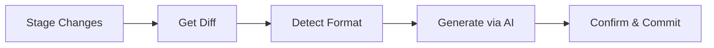

<p align="center">
  
</p>

<h1 align="center">git-sc</h1>

<p align="center">
  AI-powered smart commit message generator for coding agents
</p>

<p align="center">
  <a href="https://github.com/owayo/git-smart-commit/actions/workflows/release.yml">
    
  </a>
  <a href="https://github.com/owayo/git-smart-commit/actions/workflows/ci.yml">
    
  </a>
  <a href="https://github.com/owayo/git-smart-commit/releases/latest">
    
  </a>
  <a href="LICENSE">
    
  </a>
</p>

<p align="center">
  <a href="README.md">English</a> |
  <a href="README.ja.md">日本語</a>
</p>

---

## Features

- **Multi-Provider Support**: Supports Antigravity CLI (`agy`, the successor of Gemini CLI), Codex CLI, Claude Code, opencode, and Apple Intelligence with automatic fallback
- **Smart Cooldown**: Automatically demotes failed providers for 1 hour (configurable)
- **Format Detection**: Detects commit format from recent commits (Conventional, Bracket, Emoji, etc.)
- **Empty Repo Safe**: Auto format detection falls back cleanly even when the repository has no commits and Git outputs localized messages
- **Interactive**: Prompts for confirmation before committing (skip with `-y`)
- **Dry Run**: Preview generated messages without committing (`-n`)
- **Quiet Mode**: Suppresses progress output for hook/scripting use (`-q`)
- **Body Support**: Generate detailed commit messages with bullet points (`-b`)
- **Amend/Squash/Reword**: Regenerate messages for existing commits
- **Private Temp Files**: AI prompts, Codex final-output files, and reword message files are created without group/other read permissions on Unix/macOS
- **Agent Context**: Integrates with [claw-hooks](https://github.com/owayo/claw-hooks) to generate context-aware messages reflecting the agent's intent

## Requirements

- **OS**: macOS, Linux, Windows
- **Git**: Required
- **AI Provider** (at least one):
  - Antigravity CLI (`agy`, successor of Gemini CLI): see https://antigravity.google/docs/gcli-migration (the legacy Gemini CLI stops serving requests on 2026-06-18)
  - Codex CLI: `npm install -g @openai/codex`
  - Claude Code: `curl -fsSL https://claude.ai/install.sh | bash`
  - opencode: `curl -fsSL https://opencode.ai/install | bash`
  - Apple Intelligence: Built-in on macOS (macOS 26+ with Apple Silicon required)

## Installation

### Homebrew (macOS/Linux)

```bash
brew install owayo/git-sc/git-sc
```

### From Source

```bash
git clone https://github.com/owayo/git-smart-commit.git
cd git-smart-commit
make install
```

### From GitHub Releases

Download the latest binary from [Releases](https://github.com/owayo/git-smart-commit/releases).

#### macOS (Apple Silicon)

```bash
curl -L https://github.com/owayo/git-smart-commit/releases/latest/download/git-sc-aarch64-apple-darwin.tar.gz | tar xz
sudo mv git-sc /usr/local/bin/
```

#### macOS (Intel)

```bash
curl -L https://github.com/owayo/git-smart-commit/releases/latest/download/git-sc-x86_64-apple-darwin.tar.gz | tar xz
sudo mv git-sc /usr/local/bin/
```

#### Linux (x86_64)

```bash
curl -L https://github.com/owayo/git-smart-commit/releases/latest/download/git-sc-x86_64-unknown-linux-gnu.tar.gz | tar xz
sudo mv git-sc /usr/local/bin/
```

#### Linux (ARM64)

```bash
curl -L https://github.com/owayo/git-smart-commit/releases/latest/download/git-sc-aarch64-unknown-linux-gnu.tar.gz | tar xz
sudo mv git-sc /usr/local/bin/
```

#### Windows

Download `git-sc-x86_64-pc-windows-msvc.zip` from [Releases](https://github.com/owayo/git-smart-commit/releases), extract, and add to PATH.

## Quickstart

```bash
# Generate commit message for staged changes
git-sc

# Stage all and commit without confirmation
git-sc -a -y

# Preview message (dry run)
git-sc -n
```

## Usage

### Commands

| Command | Description |
|---------|-------------|
| `git-sc` | Generate message for staged changes |
| `git-sc init` | Initialize configuration file |
| `git-sc -a` | Stage all changes and generate message |
| `git-sc --amend` | Regenerate message for last commit |
| `git-sc --squash <BASE>` | Squash all commits into one |
| `git-sc --reword <HASH>` | Regenerate message for specific commit |
| `git-sc -g <HASH>` | Generate from existing commit (output only) |

### Options

#### Basic Options

| Option | Short | Description |
|--------|-------|-------------|
| `--yes` | `-y` | Skip confirmation prompt |
| `--dry-run` | `-n` | Show message without committing |
| `--all` | `-a` | Stage all changes |
| `--body` | `-b` | Generate with body (bullet points) |

#### Operation Modes

| Option | Short | Description |
|--------|-------|-------------|
| `--amend` | | Regenerate message for last commit |
| `--squash` | | Squash all commits into one |
| `--reword` | | Regenerate message for specific commit |
| `--generate-for` | `-g` | Generate from commit diff (output only) |

Operation modes (`--amend`, `--squash`, `--reword`, `--generate-for`) are mutually exclusive. Combining them fails during argument parsing instead of silently choosing one mode.

`--amend` note:
- Also works when the current `HEAD` is the root commit.
- Preserves unrelated staged changes instead of folding them into the amended commit.

`--reword` note:
- Only accepts commits reachable from the current `HEAD` history.
- Passing a hash from another branch (not in current history) fails with an error.
- Passing a merge commit hash also fails, even when the merge commit itself is the reword target.
- Rewording the oldest commit in current history is also supported (internally uses `git rebase -i --root` when required).
- Rewording `HEAD` preserves unrelated staged changes instead of folding them into the rewritten commit.

`--squash` note:
- Fails before rewriting history when unrelated staged changes already exist. Commit, unstage, or stash them first.

#### Settings

| Option | Short | Description |
|--------|-------|-------------|
| `--provider` | `-p` | Use specific AI provider (antigravity, codex, claude, opencode, apple-intelligence). The legacy name `gemini` is accepted as a backward-compatible alias for `antigravity`. |
| `--lang` | `-l` | Override commit message language |

#### Debug & Info

| Option | Short | Description |
|--------|-------|-------------|
| `--quiet` | `-q` | Suppress progress messages |
| `--debug` | `-d` | Show prompts sent to AI |
| `--help` | `-h` | Print help |
| `--version` | `-V` | Print version |

`--quiet` behavior:
- Suppresses progress, preview, and success/cancel messages in normal/amend/squash/reword flows
- Keeps error output visible
- In `--generate-for` mode, still prints only the generated commit message (for piping/scripting)

### Examples

```bash
# Basic usage
git-sc                      # Generate for staged changes
git-sc -a -y                # Stage all and commit directly

# Preview and body
git-sc -n                   # Dry run (preview only)
git-sc -b                   # Include detailed body

# Amend and squash
git-sc --amend              # Regenerate last commit message
git-sc --squash origin/main # Squash feature branch commits

# Generate from existing commits
git-sc -g abc1234           # Generate from commit diff
git-sc -g abc1234 -b        # With detailed body
```

## Configuration

### Initial Setup

Initialize configuration with `git-sc init`, or create `~/.config/git-sc/config.toml` manually:

```bash
git-sc init
```

This creates a configuration file with default settings at `~/.config/git-sc/config.toml`.

Use `--force` to overwrite an existing configuration:

```bash
git-sc init --force
```

### Hierarchical Configuration

git-sc supports hierarchical configuration with project-level overrides:

| File | Scope | Description |
|------|-------|-------------|
| `~/.config/git-sc/config.toml` | Global | User-wide default settings |
| `.git-sc` | Project | Repository-specific overrides (in repo root) |

Project settings override global settings. Fields not specified in project config inherit from global config. You can specify only the fields you want to override — partial `[models]` sections are supported.

### Example Configuration

```toml
# AI provider priority
# "antigravity" is the successor of the legacy Gemini CLI (`agy` command).
# Writing "gemini" instead is still accepted as a backward-compatible alias.
providers = ["opencode", "antigravity", "codex", "claude", "apple-intelligence"]

# Commit message language
language = "Japanese"

# Commit prefix format (optional)
# Values: conventional, bracket, colon, emoji, plain, none
prefix_type = "conventional"

# Auto-push after commit (optional)
auto_push = true

# Codex reasoning effort passed via `-c model_reasoning_effort=<value>`
# Values: "low" (default), "medium", "high", "xhigh", or "" to omit and use codex default
codex_reasoning_effort = "low"

# Model configuration
# Note: Antigravity CLI (`agy`) does not accept a model flag, so no `gemini` line is needed here.
# A legacy `gemini = "..."` value is parsed for backward compatibility but ignored at runtime.
[models]
codex = "gpt-5.2"
claude = "haiku"
opencode = ""

# Provider cooldown (minutes)
provider_cooldown_minutes = 60

# Provider timeout (seconds) per call
provider_timeout_seconds = 60
```

### Configuration Options

| Option | Description | Default |
|--------|-------------|---------|
| `providers` | AI provider priority (use `antigravity`; `gemini` is accepted as an alias) | `["opencode", "antigravity", "codex", "claude", "apple-intelligence"]` |
| `language` | Commit message language | `"Japanese"` |
| `prefix_type` | Commit prefix format | Auto-detect |
| `auto_push` | Auto-push after commit | `false` |
| `codex_reasoning_effort` | Codex `-c model_reasoning_effort` value (`low`, `medium`, `high`, `xhigh`, or `""` to omit) | `"low"` |
| `models.*` | Model for each provider | See config |
| `provider_cooldown_minutes` | Failed provider cooldown; extremely large values are treated as effectively indefinite | `60` |
| `provider_timeout_seconds` | Provider call timeout | `60` |
| `prefix_rules` | URL-based prefix format | `[]` |
| `prefix_scripts` | External prefix scripts | `[]` |

Existing global config files are not rewritten automatically. The current Codex default is `gpt-5.2`; to use it in an existing setup, update `models.codex` in `~/.config/git-sc/config.toml`. This default was revalidated against the available Codex model list on May 31, 2026 (JST).

Provider cooldown state normalizes legacy aliases before reordering providers, so `gemini`/`agy` cooldown entries still apply to `antigravity`, and legacy `apple-ai` / `apple_intelligence` entries still apply to `apple-intelligence`.

### prefix_type Values

| Value | Example | Description |
|-------|---------|-------------|
| `conventional` | `feat: add feature` | Conventional Commits format |
| `bracket` | `[feat] add feature` | Bracket-style prefix |
| `colon` | `feat: add feature` | Simple colon prefix |
| `emoji` | `:sparkles: add feature` | Emoji prefix |
| `plain` | `Add feature` | No prefix |
| `none` | `add feature` | No prefix, lowercase |

### Prefix Rules

Specify commit format by remote URL:

```toml
[[prefix_rules]]
url_pattern = "github\\.com[:/]myorg/"
prefix_type = "conventional"  # conventional, bracket, colon, emoji, plain
```

### Prefix Scripts

Custom prefix generation via external scripts:

```toml
[[prefix_scripts]]
url_pattern = "^https://gitlab\\.example\\.com/"
script = "/path/to/prefix-generate.py"
```

If a prefix script returns a valid `prefix_type` name (e.g. `conventional`, `bracket`, `emoji`, etc.) instead of a literal prefix string, git-sc interprets it as a Rule mode. This allows scripts to dynamically select the commit format based on branch name or remote URL.

For literal prefix strings, trailing line endings (`\n`/`\r\n`) from common script output such as `echo` are removed, while intentional trailing spaces are preserved.

If a prefix script returns empty output (exit `0` with no text), git-sc keeps the generated message as-is, except it removes a leading Conventional Commit type prefix (for example `feat:`, `fix(scope):`, `feat!:`) when present.

If a prefix script exits with code `1`, git-sc keeps the AI-generated message without adding a prefix. Other non-zero exit codes are treated as script execution failures, so git-sc falls back to the next matching prefix script, prefix rule, configured `prefix_type`, or auto detection.

For project-level `.git-sc`, relative `script` paths are resolved from the Git repository root, and the script runs with the Git root as its working directory.

```bash
#!/bin/bash
# Example: return "conventional" to use Conventional Commits format
echo "conventional"
```

## Diff Processing

- Whitespace-only changes excluded
- Binary files excluded
- Quoted diff headers with spaces or non-ASCII file paths are handled correctly
- `.git-sc-ignore` patterns applied
- Truncated at 10,000 characters

### Security Notes

- AI prompts may contain staged diff content. When git-sc needs a temporary prompt file for providers such as opencode, or a final-output file for Codex, it creates the file with no group/other permissions on Unix/macOS and removes it automatically after use.
- Reword message temporary files use the same private-file behavior.

### .git-sc-ignore

Patterns are matched against the decoded Git path, so quoted diff headers such as Japanese filenames escaped by Git are excluded correctly as well.
Rename diffs are checked against both the source path and destination path, so moving a file into an ignored directory is excluded consistently too.
Filenames containing spaces are also supported: Git does not quote space-only filenames in `diff --git` headers, but `git-sc` still extracts the correct path so that ignore patterns apply consistently.
This also covers rename headers where the source and destination paths differ and both paths contain spaces.

```gitignore
package-lock.json
yarn.lock
Cargo.lock
*.generated.ts
```

### Auto Push

Enable auto-push in your config file:

```toml
# In ~/.config/git-sc/config.toml or .git-sc
auto_push = true
```

When enabled, `git-sc` will run `git push` after a successful commit or squash.

## VS Code Extension

**[Git-SC (Smart Commit)](https://marketplace.visualstudio.com/items?itemName=owayo.vscode-git-smart-commit)** - Available on VS Code Marketplace

## Claude Code Integration

Add to `~/.claude/settings.json`:

```json
{
  "hooks": {
    "Stop": [
      {
        "matcher": "",
        "hooks": [
          {
            "type": "command",
            "command": "git-sc --all --yes --quiet"
          }
        ]
      }
    ]
  }
}
```

## Agent Context (claw-hooks Integration)

When git-sc is used with [claw-hooks](https://github.com/owayo/claw-hooks), it automatically receives context about what the coding agent was working on via the `CLAW_HOOKS_AGENT_MESSAGE` environment variable. This context is included in the AI prompt, enabling the generated commit message to reflect the high-level intent rather than just describing the raw diff.

**claw-hooks** is a companion tool that manages Claude Code's hook lifecycle. When its stop hook fires, it sets `CLAW_HOOKS_AGENT_MESSAGE` with the agent's last activity summary before invoking git-sc.

```bash
# Automatically set by claw-hooks stop hook
# CLAW_HOOKS_AGENT_MESSAGE="Refactored authentication to use JWT tokens"
git-sc -a -y -q
```

When the environment variable is set, the prompt includes an "Agent Context" section that guides the AI to prioritize the developer's intent.
This applies to standard commit generation as well as `--amend`, `--reword`, `--squash`, and `--generate-for`.

## How It Works


```mermaid
flowchart LR
    A[Stage Changes] --> B[Get Diff]
    B --> C[Detect Format]
    C --> D[Generate via AI]
    D --> E[Confirm & Commit]
```

1. **Verify**: Check git repo and AI agent availability
2. **Config**: Load `~/.config/git-sc/config.toml` settings
3. **Diff**: Get staged changes (with exclusions)
4. **Format**: Detect from recent commits or rules
5. **Generate**: Send to AI with fallback
6. **Commit**: Confirm and create commit

## Apple Intelligence

Apple Intelligence provider uses [fm-rs](https://github.com/blacktop/fm-rs) (Rust bindings for Apple's [Foundation Models](https://developer.apple.com/documentation/foundationmodels) framework) for fully on-device inference. No API key or network connection is required.

- **Requirements**: macOS 26 (Tahoe) or later, Apple Silicon, Apple Intelligence enabled in System Settings
- **How it works**: With Apple Intelligence enabled (default on macOS), git-sc calls Foundation Models directly via fm-rs. A `LanguageModelSession` is created with commit-message-specific instructions for each generation.
- **Build**: `cargo build --features apple-ai` (automatic with `make build` / `make install` on macOS)
- **Cross-platform**: On Linux/Windows, Apple Intelligence is not available and is automatically skipped

## Build Commands

| Command | Description |
|---------|-------------|
| `make build` | Build debug version |
| `make release` | Build release version |
| `make install` | Build and install to /usr/local/bin |
| `make test` | Run tests |
| `make fmt` | Format code |
| `make check` | Run clippy and cargo check (includes `apple-ai` on macOS) |
| `make clean` | Clean build artifacts |

## Contributing

Contributions are welcome! Please feel free to submit a Pull Request.

## Changelog

See [Releases](https://github.com/owayo/git-smart-commit/releases) for version history.

## License

[MIT](LICENSE)
